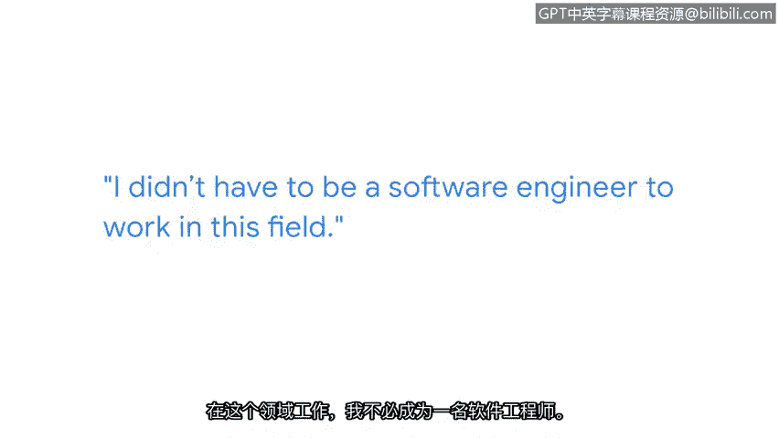
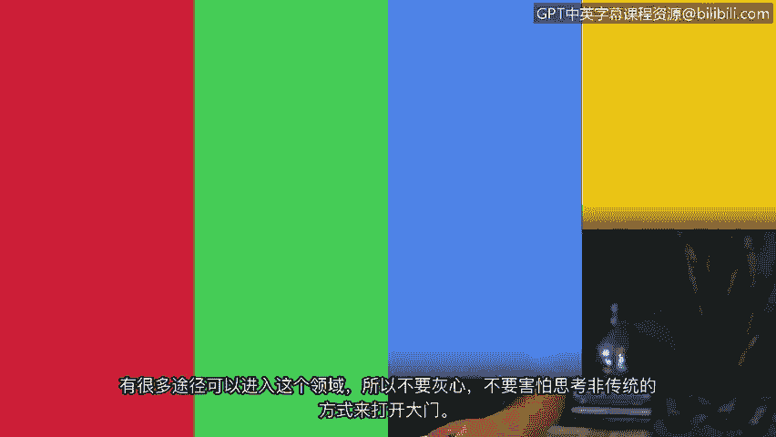

# 005：阿什利的网络安全职业道路

在本节课中，我们将跟随谷歌员工阿什利的分享，了解她非传统的职业发展路径，并从中学习进入网络安全领域所需的关键技能与心态。她的经历表明，成功之路并非总是线性的，核心技能也远不止于技术。

我的名字是阿什利，我在谷歌的职位是SEOP销售客户工程师赋能负责人。这意味着我负责为支持我们产品的客户工程师设立培训项目。

我从小就喜欢电脑和互联网。我拥有历史上最早的AOL屏幕名之一，并为此感到非常自豪。我父亲是一名工程师，我想我一直对科技有兴趣。但当我高中毕业时，并没有一条清晰的路径进入这个行业。我的道路完全不是线性的。

我成长过程中有点像个“愣头青”。我在十年级就放弃了，很长一段时间对什么都不在乎，经常惹麻烦。我几乎告诉自己，如果我不参军离开这里，继续这样下去，我可能两三年内就不在这里了。于是，我高中一毕业就加入了陆军。六月毕业，四天后我就在南卡罗来纳州的杰克逊堡新兵训练营了——信不信由你，我当时是一名小号手。

退伍回来后，我需要找一份工作。那时我甚至没有关注科技类的工作。我曾在大型五金店拉购物车、卖电子游戏、在货运公司做零售装箱工。在所有这些经历之后，我才意识到科技是一个选择。

军队很好心地让我接受了IT再培训。这可以说是我获得的第一波正式教育，让我能够说：“嘿，我至少具备了成为一名PC技术员的技能。”之后，我回到社区大学，并找到了一个网络安全副学士学位项目，学习了一些认证。我参加了第一次Defcon大会（一个大型黑客会议），这就像点亮了一盏明灯，让我真正看清了未来的道路可能是什么样子。

我在2017年找到了第一份安全分析师的工作。我参加了上一家公司的一个退伍军人培训项目（该项目对退伍军人免费），并从培训中直接被录用。在来到谷歌之前，我在那家公司工作了将近五年。

## 进入网络安全领域的关键技能

上一节我们了解了阿什利的职业转折点，本节中我们来看看她认为进入该领域需要掌握哪些核心技能。她特别强调了非技术能力的重要性。

如果你是新入行者，你必须知道如何与团队合作。我认为我们很多人是在客户服务环境中学会这一点的。我在零售业工作中学到的一些技能，比如应对难缠的客户、学习如何与人沟通、甚至在人们不满时如何化解局面，这些与人打交道的技能在IT领域同样需要。如今，我们需要的不仅仅是技术技能，更需要成为“T型人才”——即同时具备软技能、人际交往能力和技术技能。

你必须具备良好的分析能力。同样，这甚至不一定是技术分析。如果你能阅读一本书并剖析其中的修辞手法，你就能做分析工作。

**核心公式：T型人才 = 软技能 + 人际技能 + 技术技能**

## 克服常见障碍与心态建议

了解了所需技能后，初学者常会遇到一些心理障碍。阿什利对此给出了直接而鼓舞人心的建议。

对我们许多人来说，存在一种对数学的恐惧，编程也是一大障碍。但我们的工作是与人打交道、与流程打交道。你并不一定需要编码知识来理解人或流程。进入这个领域的方式有很多，所以不要气馁，也不要害怕跳出框框思考，以迈出第一步。

**核心心态：`if (mathFear || codingHurdle) { 不要气馁; 跳出框框思考; }`**

---

本节课中，我们一起学习了阿什利从迷茫青年到谷歌网络安全专家的非典型职业路径。她的经历告诉我们：**职业道路可以是非线性的**，早期各种经历（甚至是军队、零售业）都能转化为宝贵技能。成功进入网络安全领域的关键在于成为“T型人才”，即**结合技术能力、分析思维与卓越的软技能**。同时，**不必被数学或编程吓倒**，该领域存在多种切入点，保持开放心态和持续学习的态度至关重要。