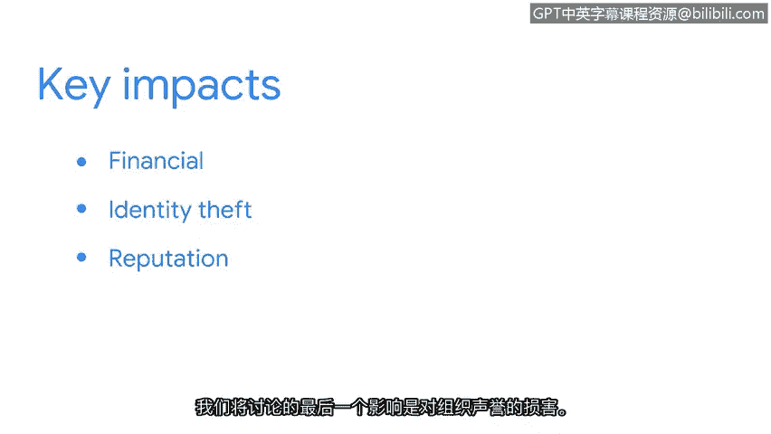

# 007：威胁、风险与漏洞的关键影响 🔐

在本节课程中，我们将探讨一种代价高昂的恶意软件——勒索软件，并分析威胁、风险与漏洞对组织运营产生的三个关键影响。

## 勒索软件攻击

勒索软件是一种恶意攻击，攻击者会加密组织的数据，然后索要赎金以恢复访问权限。一旦攻击者部署了勒索软件，它可以冻结网络系统，使设备无法使用，并加密或锁定机密数据，导致设备无法访问。攻击者随后会要求支付赎金，才会提供解密密钥，让组织恢复正常业务运营。

您可以将解密密钥理解为用于重新获取数据访问权限的密码。

请注意，当赎金谈判发生或攻击者泄露数据时，这些事件可能通过暗网进行。

## 网络的层次

虽然许多人使用搜索引擎访问社交媒体或在线购物，但这只是网络真实面貌的一小部分。网络实际上是一个由三层结构相互链接的在线内容网络：表层网、深层网和暗网。

*   **表层网**：这是大多数人使用的一层。它包含可以通过网页浏览器访问的内容。
*   **深层网**：通常需要授权才能访问。组织的内部网络就是深层网的一个例子，因为它只能由员工或被授予访问权限的人访问。
*   **暗网**：只能通过特殊软件访问。暗网通常带有负面含义，因为其提供的隐秘性使其成为犯罪分子的首选网络层。

## 威胁、风险与漏洞的三个关键影响

上一节我们介绍了勒索软件和网络层次，本节中我们来看看威胁、风险与漏洞对组织产生的具体影响。以下是三个关键方面：

**1. 财务影响**
当组织的资产（例如因恶意软件攻击）受到损害时，其财务后果可能非常严重，原因多样。这些原因包括：
*   生产和服务中断。
*   解决问题的成本。
*   若因不遵守法律法规导致资产受损，可能面临的罚款。

**2. 身份盗窃**
组织必须决定是否存储客户、员工及外部供应商的私人数据，以及存储多久。存储任何类型的敏感数据都会给组织带来风险。敏感数据包括个人身份信息（PII），这些信息可能通过暗网被出售或泄露。这是因为暗网提供了一种隐秘感，攻击者可能在那里出售数据而无需承担法律后果。

**3. 对组织声誉的损害**
稳固的客户基础支持着组织的使命、愿景和财务目标。一个被利用的漏洞可能导致客户转向与竞争对手建立新的业务关系，或产生负面报道，对组织的声誉造成永久性损害。客户数据的丢失不仅影响组织的声誉和财务状况，还可能导致法律处罚和罚款。

## 总结与展望

本节课中，我们一起学习了勒索软件的运作方式、网络的三个层次（表层网、深层网、暗网），以及威胁、风险与漏洞带来的财务影响、身份盗窃风险和声誉损害这三个关键影响。组织被强烈建议采取适当的安全措施并遵循特定协议，以预防威胁、风险和漏洞带来的重大影响。通过运用安全工具箱中的所有工具，安全团队能更好地应对诸如勒索软件攻击等事件。

接下来，我们将介绍NIST风险管理框架中管理风险的七个步骤。