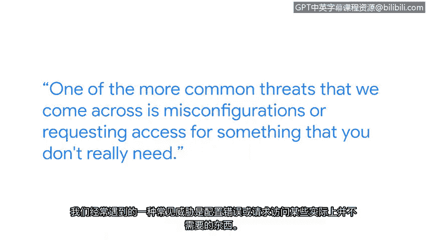

# 008：赫伯特谈管理威胁、风险与漏洞


在本节课中，我们将跟随谷歌安全工程师赫伯特的分享，了解网络安全分析师如何在实际工作中管理威胁、风险和漏洞。我们将学习到日常安全工作的核心内容、常见的安全问题以及团队协作的重要性。

---

我的名字是赫伯特，我是谷歌的一名安全工程师。我认为我一直对安全领域很感兴趣。高中时，学校给我们发了这些巨大的戴尔笔记本电脑。那些电脑里并没有太多的安全措施，所以我的很多朋友都有像《光环》这类视频游戏的破解版本。那确实是我开始学习如何操控电脑，让它按我的意愿行事的地方。

我日常工作包括分析安全风险，并为这些风险提供解决方案。网络安全分析师的一项典型任务通常是处理例外请求，分析某人是否因其角色或正在进行的项目，而需要获得对某个设备或文档的特殊访问权限。

我们遇到的一个更常见的威胁是配置错误，或是请求他们并不真正需要的访问权限。例如，我最近遇到一个案例，与我们合作的一个供应商更改了他们的OAuth范围请求。这基本上意味着，他们请求使用谷歌服务的权限比过去更多。我们之前不确定该如何处理，因为这是我们以前没有遇到过的情况。所以这件事仍在处理中，但我们正在与合作伙伴团队合作，以制定一个解决方案。

我认为我们看到的另一个问题是系统过时，即需要打补丁的机器。

这听起来像是一个IT问题，但它也绝对是一个网络安全问题。拥有过时的机器，没有适当的设备管理策略。

与一个团队或许多团队合作是这项工作的一个重要部分。为了真正完成任何事情，你不仅需要与你所在的团队沟通，还需要与其他团队沟通。十年前，我在一家披萨店工作。十年后，我在这里，在谷歌担任安全工程师。如果我告诉16岁的自己，我会在这里，我自己都不会相信。但这是可能的。

---

## 核心概念与工作流程

上一节我们了解了赫伯特的日常工作内容，本节中我们来看看其中涉及的一些核心概念和典型工作流程。

以下是网络安全分析师处理安全请求的基本分析步骤：

1.  **接收请求**：收到关于特殊访问权限或变更的请求。
2.  **分析上下文**：评估请求者的**角色**和**项目**需求。公式表示为：`访问权限必要性 = f(角色， 项目需求)`。
3.  **风险评估**：判断授予权限可能引入的**风险**，例如数据泄露或系统滥用。
4.  **制定方案**：与相关团队协作，制定既满足业务需求又控制风险的解决方案。
5.  **执行与监控**：实施解决方案，并持续监控其效果。



## 常见安全威胁示例

除了处理访问请求，识别和应对常见威胁也是关键工作。以下是赫伯特提到的两类主要威胁：

*   **配置错误与权限泛滥**：例如供应商过度请求API权限（`OAuth scope`过大）。代码示例可能表现为一个过宽的权限范围请求：
    ```json
    // 不安全的过宽权限请求示例
    {
      "scope": "https://www.googleapis.com/auth/cloud-platform"
    }
    // 应遵循最小权限原则，请求具体所需的权限
    {
      "scope": "https://www.googleapis.com/auth/drive.file"
    }
    ```
*   **系统过时与未打补丁**：运行未安装最新安全补丁的软件或操作系统，使已知漏洞可被利用。

## 团队协作与沟通

正如赫伯特所强调的，解决安全问题很少能单打独斗。有效的**团队协作**和**沟通**是成功的关键。安全工程师需要与IT部门、软件开发团队、法务部门以及外部合作伙伴等多个团队紧密合作，共同制定和执行安全策略。

---


本节课中我们一起学习了网络安全分析师的实际工作缩影。我们了解到，这份工作不仅仅是技术分析，更涉及基于风险的管理决策、对常见威胁（如错误配置和系统过时）的持续警惕，以及跨团队协作沟通的软技能。赫伯特的经历也表明，进入这个充满挑战的领域有多种路径，关键在于保持学习热情和动手实践。