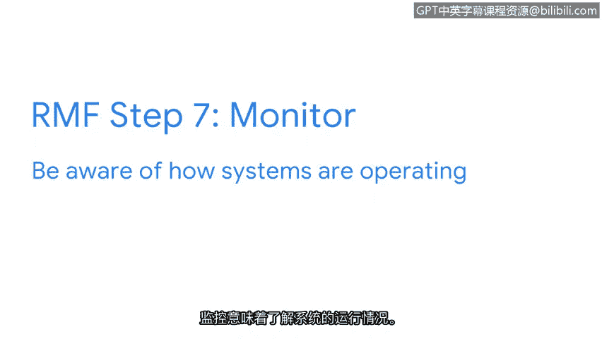

# 009：NIST风险管理框架 📊

在本节课程中，我们将学习美国国家标准与技术研究院（NIST）的风险管理框架（RMF）。该框架为安全专业人员提供了一套系统化的流程，用于管理组织面临的风险、威胁和漏洞。掌握这一基础框架，能帮助你在安全领域的求职中脱颖而出。

你可能还记得，NIST为安全专业人员提供了许多用于管理风险、威胁和漏洞的框架。本节视频，我们将重点介绍NIST的风险管理框架（RMF）。作为初级分析师，你可能不会参与所有步骤，但熟悉这个框架非常重要。

## 风险管理框架的七个步骤

RMF包含七个步骤：准备、分类、选择、实施、评估、授权和监控。让我们从第一步开始。

### 第一步：准备 🛡️

“准备”指的是在安全事件发生前，为管理安全和隐私风险所必需的活动。作为初级分析师，你可能会在这一步中监控风险，并识别可用于降低这些风险的控制措施。

上一节我们介绍了准备阶段，接下来我们看看如何对风险进行分类。

### 第二步：分类 📂

“分类”用于制定风险管理流程和任务。安全专业人员通过思考系统的**机密性、完整性和可用性**如何受到风险影响，来使用这些流程并制定任务。作为初级分析师，你需要能够理解如何遵循组织建立的流程，以降低关键资产（如客户私人信息）的风险。

在明确了风险类别后，下一步就是选择具体的控制措施。

### 第三步：选择 ✅

“选择”意味着选择、定制并记录保护组织的控制措施。选择步骤的一个例子是保持操作手册的更新，或帮助管理其他文档，使你和你的团队能更高效地处理问题。

以下是选择控制措施时可能涉及的文档类型：
*   安全策略与程序手册
*   事件响应操作手册
*   系统配置基线文档

选定了控制措施，接下来就需要将它们付诸实践。

### 第四步：实施 🚀

第四步是为组织实施安全和隐私计划。制定完善的计划对于最小化持续安全风险的影响至关重要。例如，如果你注意到员工频繁需要重置密码的模式，实施密码要求的变更可能有助于解决此问题。

计划实施后，我们必须评估其有效性。

### 第五步：评估 🔍

“评估”意味着确定已建立的控制措施是否正确实施。组织总是希望尽可能高效地运作，因此花时间分析已实施的协议、程序和控制措施是否满足组织需求至关重要。在此步骤中，分析师会识别潜在弱点，并确定是否应更改组织的工具、程序、控制和协议，以更好地管理潜在风险。

评估确认控制措施有效后，就需要获得正式授权。

### 第六步：授权 📝

“授权”意味着对组织中可能存在的安全和隐私风险承担责任。作为分析师，授权步骤可能涉及生成报告、制定行动计划，以及建立与组织安全目标一致的项目里程碑。

获得授权后，持续监控是确保长期安全的关键。

### 第七步：监控 📈

“监控”意味着了解系统的运行状况。评估和维护技术操作是分析师日常完成的任务。维持组织低风险水平的一部分，是了解当前系统如何支持组织的安全目标。如果现有系统无法满足这些目标，则可能需要进行变更。虽然建立这些程序可能不是你的工作，但你需要确保它们按预期工作，以最小化对组织本身及其所服务人员的风险。

## 总结

本节课中，我们一起学习了NIST风险管理框架（RMF）的七个核心步骤：准备、分类、选择、实施、评估、授权和监控。理解这个框架能帮助你系统化地思考安全风险，并为你在实际工作中遵循组织流程、有效识别和管理风险奠定坚实基础。记住，即使作为初级分析师，熟悉这些基础概念也对你的职业发展大有裨益。