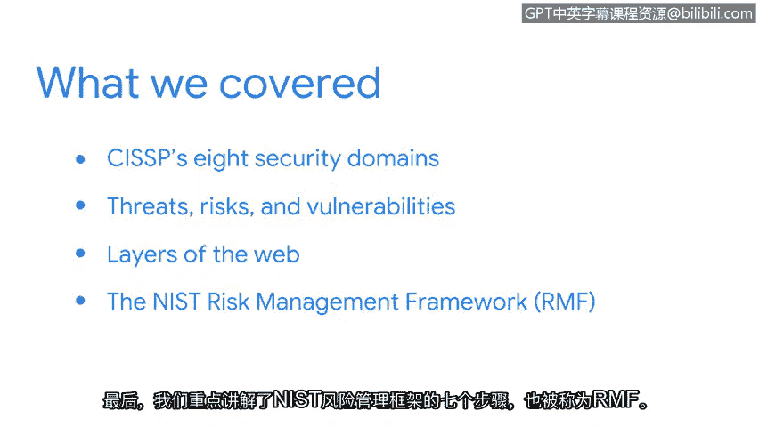

# 010：总结

在本节课程中，我们回顾了安全风险管理基础部分的核心内容。现在，让我们一起来总结所学知识。

## 课程内容回顾

上一节我们介绍了安全风险管理的多个核心概念。本节中，我们来系统回顾一下已讨论的关键点。

以下是本阶段课程涵盖的主要主题：

*   **CISSP八大安全域**：我们探讨了这些安全域如何构成信息安全的基础框架。
*   **威胁、风险与漏洞**：我们分析了这三者的定义、区别以及它们对组织可能产生的具体影响。
*   **勒索软件**：我们深入研究了这种特定威胁的运作机制和危害。
*   **网络三层结构**：我们介绍了应用层、传输层和网络层这三层基本模型。
*   **NIST风险管理框架**：我们重点学习了该框架的七个步骤，即**RMF**。

## 学习成果与展望

你出色地完成了本阶段学习，为你的安全分析师工具箱增添了新知识。

在接下来的课程中，我们将深入探讨入门级安全分析师常用的一些工具。你将有机会分析这些工具生成的数据，以识别风险、威胁或漏洞。你还将有机会使用**事件响应手册**来模拟处理安全事件。

本节课中，我们一起学习了安全风险管理的基础模块，包括核心概念、框架和特定威胁。请继续保持出色的学习状态。