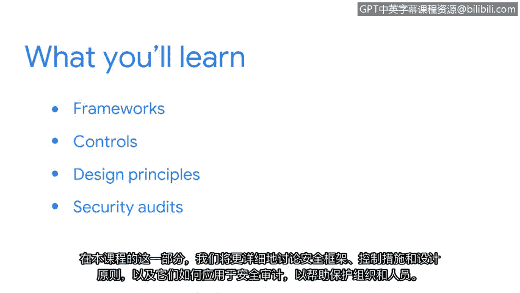

# 011：安全风险管理

## 概述
在本节课中，我们将学习安全框架、安全控制措施以及安全设计原则。这些知识是安全分析师工作的基础，能帮助我们通过安全审计来保护组织和个人的安全。

---

欢迎回来。作为一名安全分析师，你的工作不仅仅是保护组织的安全。你的角色更为重要。你也在帮助保护人们的安全。影响客户、供应商和员工数据的泄露，可能会对人们的财务稳定性和声誉造成重大损害。作为一名分析师，你的日常工作将有助于保护个人和组织的安全。

在本课程的这个部分，我们将更详细地讨论安全框架、控制措施和设计原则，以及如何将它们应用于安全审计，以帮助保护组织和人员。

在谷歌，保护客户信息的机密性是我日常工作的关键部分，而NIST网络安全框架在其中扮演了重要角色。该框架通过使用安全控制措施，确保了对客户工具和个人工作设备的保护与合规性。

欢迎来到安全框架与控制措施的世界。让我们开始吧。

---

## 总结
本节课中，我们一起学习了安全分析师角色的重要性，并引入了安全框架、控制措施和设计原则的核心概念。这些工具是进行有效安全审计、保护组织与个人免受数据泄露风险的基础。