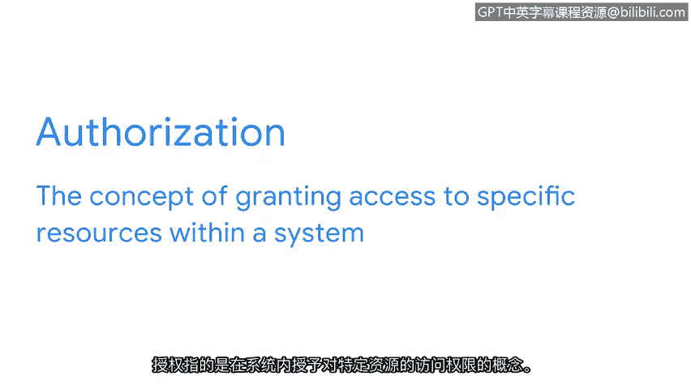

# 013：控制

在本节课程中，我们将学习安全控制措施。控制措施是用于降低特定安全风险的具体手段。我们将探讨三种常见的控制类型：加密、身份验证和授权，并了解它们如何共同构成CIA安全模型的基础。

## 概述

框架用于制定应对安全风险、威胁和漏洞的计划，而控制措施则用于降低特定风险。如果未实施适当的控制措施，组织可能因暴露于风险（如非法入侵、创建虚假员工账户或提供免费福利）而面临重大的财务影响和声誉损害。

让我们回顾一下控制措施的定义。安全控制措施是为降低特定安全风险而设计的保护措施。在本视频中，我们将讨论三种常见的控制类型。

## 加密

上一节我们提到了风险管理的框架，本节中我们来看看具体的安全控制措施。首先从加密开始。

加密是将数据从可读格式转换为编码格式的过程。通常，加密涉及将数据从**明文**转换为**密文**。密文是原始的编码信息，对人类和计算机来说都是不可读的。密文数据在被解密回其原始的明文形式之前无法被读取。

加密用于确保敏感数据的机密性，例如客户的账户信息或社会安全号码。

## 身份验证

除了加密，另一种用于保护敏感数据的控制措施是身份验证。

身份验证是验证某人或某物身份的过程。一个现实世界中的身份验证例子是使用用户名和密码登录网站。这种基本形式的身份验证证明你知道用户名和密码，因此应被允许访问该网站。

更高级的身份验证方法，例如多因素身份验证，会要求用户同时提供密码和另一种身份验证形式（如安全码或指纹、声音、面部扫描等生物特征），以证明他们是其所声称的身份。

以下是关于生物特征身份验证的更多信息：
*   **生物特征**是可用于验证个人身份的唯一物理特征。
*   生物特征的例子包括指纹、眼纹扫描或掌纹扫描。
*   一种可能利用生物特征的社会工程攻击是**语音钓鱼**。语音钓鱼是利用电子语音通信来获取敏感信息或冒充已知来源的行为。例如，语音钓鱼可用于模仿一个人的声音以窃取其身份，然后实施犯罪。

## 授权

另一个非常重要的安全控制措施是授权。

授权指的是授予访问系统内特定资源权限的概念。

本质上，授权用于验证一个人是否有权限访问某个资源。举个例子，如果你作为一名初级安全分析师为联邦政府工作，你可能被授权访问通过深网或其他内部数据，这些数据只有联邦雇员才能访问。

## 总结与过渡

今天我们讨论的安全控制措施只是一个核心安全模型——CIA三要素——中的一个组成部分。接下来，我们将更多地讨论这个模型以及安全团队如何使用它来保护他们的组织。

本节课中，我们一起学习了三种核心的安全控制措施：**加密**用于保护数据机密性，**身份验证**用于确认身份，**授权**用于管理资源访问权限。理解这些控制措施是构建有效安全防御的基础。