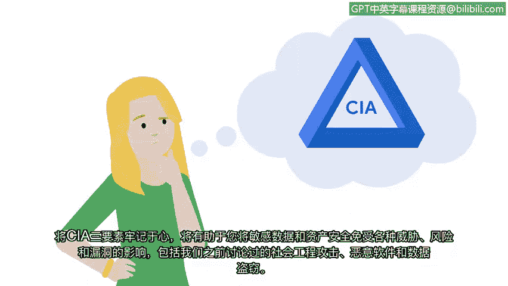

# 014：探索CIA三元模型 🔐

在本节课中，我们将要学习信息安全领域的核心模型——CIA三元模型。我们将了解其三个组成部分，并探讨如何运用该模型来保护组织的敏感资产和数据免受威胁。

## 概述

作为一名初级安全分析师，你的主要职责是帮助保护组织的敏感资产和数据免受威胁行为者的侵害。CIA三元模型是一个核心的安全模型，它将帮助你完成这项任务。本节视频将探索CIA三元模型，并讨论其每个组成部分对于保护组织免受威胁、风险和漏洞侵害的重要性。

## 什么是CIA三元模型？

CIA三元模型是一个帮助组织在建立系统和安全策略时评估风险的基础模型。该模型由三个核心原则构成，它们分别是：

*   **保密性**：指只有经过授权的用户才能访问特定的资产或数据。敏感数据应遵循“需要知道”的原则，确保只有被授权处理特定资产或数据的人员才能访问。
*   **完整性**：指数据是正确、真实且可靠的。作为安全专业人员，确定数据的完整性并分析其使用方式，将帮助你判断数据是否可信。
*   **可用性**：指数据能够被授权访问的人员获取。无法访问的数据是无用的，并且可能妨碍人们正常工作。确保系统、网络和应用程序正常运行，以提供及时可靠的访问，可能是你日常工作职责的一部分。

## 如何应用CIA三元模型？

上一节我们介绍了CIA三元模型的定义，本节中我们来看看如何运用它来保护一个组织。

假设你在一家拥有大量私人数据的组织（例如银行）工作，CIA三元模型的应用至关重要。以下是每个原则的具体体现：

*   **保密性原则至关重要**。银行必须确保客户的个人和财务信息安全。
*   **完整性原则也是优先事项**。例如，如果一个人的消费习惯或消费地点发生剧烈变化，银行很可能会暂时禁用账户访问权限，直到他们能够验证是账户所有者本人而非威胁行为者在进行交易。
*   **可用性原则同样关键**。银行投入大量精力确保人们能够通过网络轻松访问其账户信息。同时，为了保护这些信息免受威胁行为者侵害，银行会使用验证流程，以便在怀疑客户账户被盗用时，帮助将损害降至最低。

作为一名分析师，你将经常运用三元模型的每个组成部分来帮助保护你的组织及其服务对象。时刻牢记CIA三元模型，将帮助你保护敏感数据和资产免受各种威胁、风险和漏洞的侵害，包括我们之前讨论过的社会工程攻击、恶意软件和数据盗窃。

## 总结

本节课中我们一起学习了CIA三元模型——一个由**保密性**、**完整性**和**可用性**构成的核心安全框架。我们探讨了每个原则的含义，并通过银行案例了解了如何在实际工作中应用这些原则来评估风险和保护数据。掌握这个模型，将为你在后续学习具体的安全框架和原则，以更好地保护组织免受威胁、风险和漏洞侵害，打下坚实的基础。