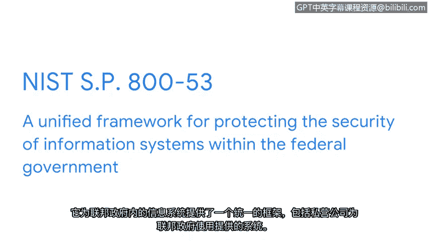

# 015：NIST框架 🛡️

在本节课中，我们将学习两个由美国国家标准与技术研究院（NIST）制定的重要网络安全框架。这些框架为全球各类组织管理网络安全风险提供了标准、指南和最佳实践。

## 框架的目的与概述

上一节我们介绍了框架的基本概念。本节中，我们来看看两个具体的NIST框架。

组织使用框架作为制定计划的起点，以降低敏感数据和资产所面临的风险、威胁和脆弱性。幸运的是，全球有许多组织创建了框架，安全专业人员可以利用这些框架来制定相应的安全计划。

## NIST网络安全框架（CSF）

我们将要讨论的第一个框架是NIST网络安全框架（CSF）。CSF是一个自愿性框架，包含用于管理网络安全风险的标准、指南和最佳实践。无论您为何种组织工作，该框架都广受尊重且对维护安全至关重要。

CSF包含五个核心功能，我们将在后续视频中详细讨论。以下是这五个功能：
*   **识别**
*   **保护**
*   **检测**
*   **响应**
*   **恢复**

现在，我们通过一个工作场景来重点了解CSF如何使组织受益，以及如何用它来防范威胁、风险和脆弱性。

## CSF应用实例

想象一下，某天早晨你收到一个高风险通知，称一台工作站已被入侵。你识别出该工作站，并发现有一个未知设备连接在上面。你远程阻止了该未知设备以阻止潜在威胁，从而保护组织。接着，你隔离受感染的工作站以防止损害扩散，并使用工具检测任何额外的威胁行为，识别该未知设备。你通过调查事件来做出响应，以确定谁使用了该未知设备、威胁是如何发生的、影响了什么以及攻击源自何处。😡 在这个案例中，你发现一名员工使用工作笔记本电脑的USB端口为其受感染的手机充电。最后，你尽力恢复任何受影响的文件或数据，并修复威胁对工作站本身造成的任何损害。

如前一示例所示，NIST CSF的核心功能为安全专业人员提供了具体的指导和方向。该框架用于制定计划，以适当且快速地处理事件，从而降低风险、保护组织免受威胁并缓解任何潜在的脆弱性。

## NIST特别出版物 800-53

NIST CSF的适用范围还扩展到了美国联邦政府的保护领域，具体体现在NIST特别出版物（SP）800-53中。它为保护联邦政府内部信息系统的安全提供了一个统一的框架，包括私营公司为联邦政府使用而提供的系统。该框架提供的安全控制用于维护政府所用系统的**CIA三要素**（机密性、完整性、可用性）。

所有这些框架和控制措施协同工作的方式非常精妙。我们在本视频中讨论了一些非常重要的安全主题，这些主题在你继续安全之旅时将非常有用，因为它们是安全专业的核心要素。

NIST CSF是一个大多数安全专业人员都熟悉的实用框架。而如果你有兴趣为美国联邦政府工作，理解NIST SP 800-53则至关重要。

## 总结

本节课中，我们一起学习了NIST网络安全框架（CSF）及其五个核心功能，并通过一个实例了解了其应用。我们还简要介绍了NIST特别出版物800-53，它专门用于保护美国联邦政府的信息系统安全。这些框架为系统化地管理网络安全风险提供了坚实的基础。

接下来，我们将继续深入探讨NIST CSF的五个功能，以及组织如何利用它们来保护资产和数据。