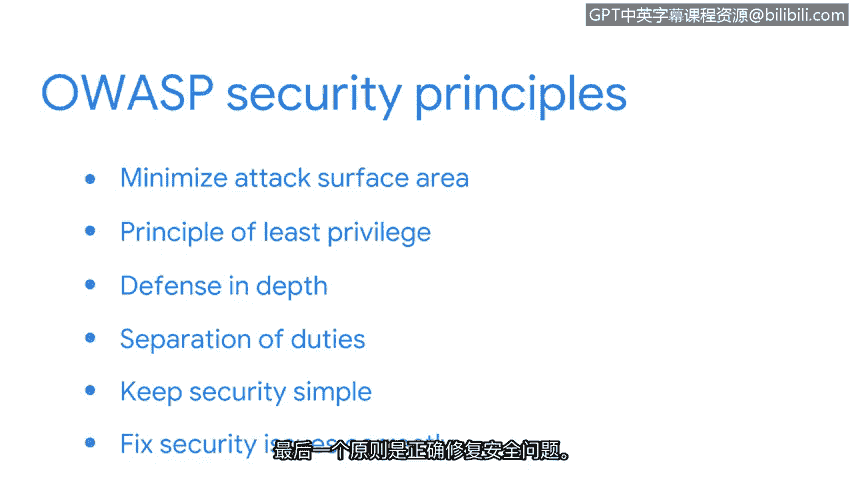

# 017：OWASP安全原则

## 概述
在本节课中，我们将学习开放网络应用安全项目（OWASP）提出的几项核心安全原则。这些原则是安全分析师用于保护组织数据和资产、最小化威胁与风险的重要指南，它们与NIST框架和CIA三要素相辅相成。

理解如何保护组织的数据和资产至关重要，因为这将是您作为安全分析师职责的一部分。幸运的是，有一些原则和指南可以与NIST框架及CIA三要素一同使用，以帮助安全团队最小化威胁和风险。

## 1. 最小化攻击面 🎯
上一节我们提到了安全原则的重要性，本节中我们首先来看看“最小化攻击面”原则。

攻击面是指威胁行为者可能利用的所有潜在漏洞，例如攻击向量——即攻击者用于渗透安全防御的途径。常见的攻击向量包括钓鱼邮件和弱密码。

为了最小化攻击面并避免由这类向量引发的事件，安全团队可以采取以下措施：
*   禁用不必要的软件功能。
*   限制对特定资产的访问权限。
*   建立更复杂的密码要求。

## 2. 最小权限原则 🔐
在了解了如何缩小攻击范围后，接下来我们关注如何控制内部访问。“最小权限原则”意味着确保用户仅拥有完成其日常工作所需的最小访问权限。

限制对组织信息和资源访问的主要原因是减少安全漏洞可能造成的损害。例如，作为一名初级分析师，您可能有权访问日志数据，但无权更改用户权限。因此，如果威胁行为者盗用了您的凭证，他们也只能获得对数字或物理资产的有限访问权限，这可能不足以让他们部署其预谋的攻击。

## 3. 纵深防御 🛡️
除了控制权限，建立多层次的防护也至关重要。我们将要讨论的下一个原则是“纵深防御”。

纵深防御意味着组织应具备多种安全控制措施，以不同的方式应对风险和威胁。安全控制的一个例子是多因素认证（MFA），它要求用户在输入用户名和密码之外，还需采取额外步骤才能访问应用程序。

以下是其他可用于建立多层防御的安全控制措施：
*   防火墙
*   入侵检测系统
*   权限设置

## 4. 职责分离 ⚖️
建立防御体系后，我们还需考虑内部制衡。“职责分离”原则可用于防止个人进行欺诈或非法活动。

该原则意味着不应赋予任何人过多的特权，以致其可能滥用系统。例如，公司里签署支票的人不应同时是准备支票的人。

## 5. 保持安全措施简单 ✨
接下来是“保持安全措施简单”的原则。顾名思义，在实施安全控制时，应避免不必要的复杂解决方案，因为它们可能变得难以管理。

安全控制措施越复杂，人们就越难进行协作。

## 6. 正确修复安全问题 🔧
最后一项原则是“正确修复安全问题”。技术是强大的工具，但也可能带来挑战。当安全事件发生时，安全专业人员需要快速识别根本原因。

此后，重要的是纠正任何已识别的漏洞并进行测试，以确保修复成功。一个典型的问题是用于访问组织Wi-Fi的密码过于简单，因为这可能导致入侵。

要修复此类安全问题，可以实施更严格的密码策略。公式表示为：**弱密码 → 潜在入侵风险**。修复方案是建立**强密码策略**。

## 总结
本节课中，我们一起学习了OWASP的六项核心安全原则：最小化攻击面、最小权限、纵深防御、职责分离、保持简单以及正确修复。虽然内容很多，但理解这些原则将提升您的整体安全知识，并帮助您作为一名安全专业人员脱颖而出。