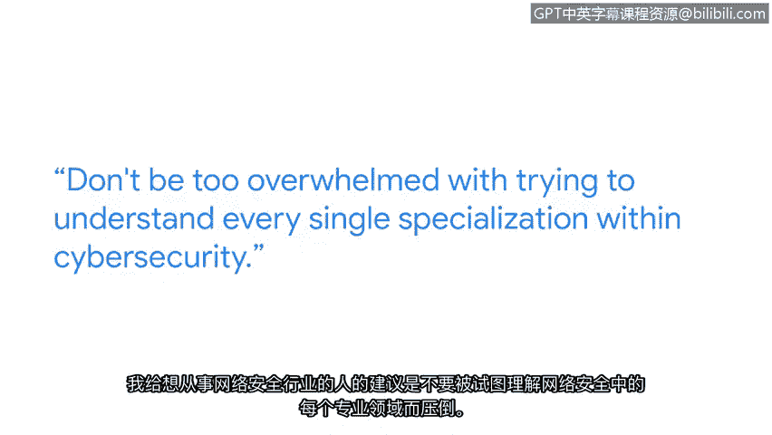

# 018：了解最新网络安全威胁

## 📚 课程概述

在本节课中，我们将跟随谷歌数字取证部门的安全工程师瓦吉赫，学习如何了解并跟进最新的网络安全威胁与趋势。课程将涵盖获取信息的策略、专业发展的建议，并鼓励初学者积极进入网络安全领域。

---

## 👤 人物介绍

我的名字是瓦吉赫，是谷歌数字取证部门的一名安全工程师。

---

## ❓ 进入网络安全领域需要背景吗？

不需要网络安全背景。我过去的经历包括在水上乐园操作制冰机，以及在大学期间在电影院售卖爆米花和零食。我本科一年级时主修生物专业。

---

## 🚌 兴趣的起源

我在公交车上遇到一个人，他提到了一家很酷的网络安全初创公司。这听起来非常酷。

---

## 🔍 跟进趋势的策略

以下是我用来跟进最新网络安全趋势的一些策略：

我利用在线论坛进行研究，例如 Medium，以探索不同的安全趋势和主题。我个人经常使用 Medium，因为我可以按标签筛选，例如查找与网络安全或云安全相关的文章。

基于其筛选算法，我可以浏览并了解其他人正在讨论的内容，这帮助我保持信息更新。

---

## 🤝 拓展人脉网络

如果你更期待拓展人脉网络，那么我强烈建议直接参加那些行业会议。

---

## 💡 给新人的建议

对于想要进入网络安全领域的人，我的建议是：不要因为试图理解网络安全内的每一个专业方向而感到不知所措。

网络安全领域在趋势方面内容非常丰富，及时了解所有这些信息固然很好，但有时你需要退一步，优先确定你最想跟进的网络安全细分主题。

---

## ❤️ 职业热情与行业现状

我热爱这份工作，也热爱其中的挑战。根据过去的经验以及从计算机科学领域其他朋友那里听到的信息，我感觉目前网络安全专业人才存在短缺。

他们中的大多数人说，进入这个领域太难、太复杂。

---

## ✨ 最后的鼓励

不要听信那些人的话。我鼓励你坚持下去，这绝对是非常值得的。首先掌握好基础知识，并保持持之以恒。

---

## 📝 课程总结

本节课中，我们一起学习了网络安全工程师瓦吉赫分享的行业见解。我们了解到进入该领域无需特定背景，可以通过在线论坛和行业会议跟进趋势，并且给新人的核心建议是：**打好基础，保持专注，持之以恒**。网络安全领域充满挑战与机遇，值得你投身其中。