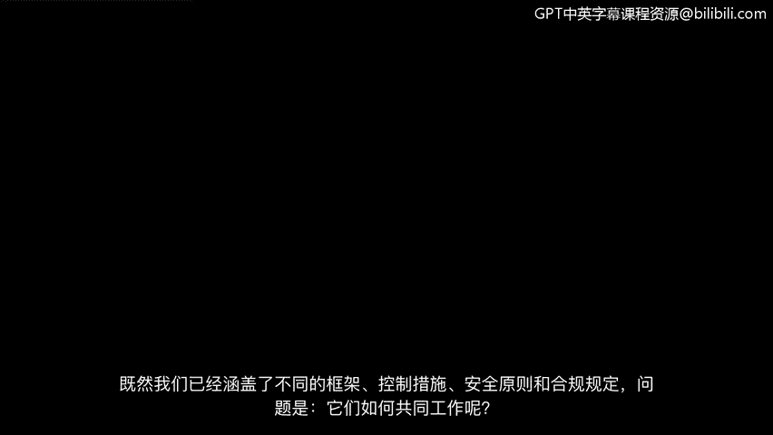
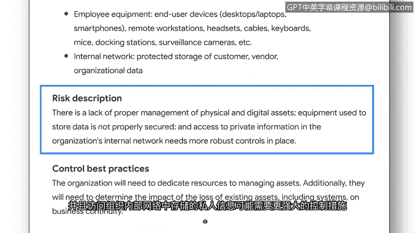

# 019：计划安全审核 🔍

## 概述
在本节课中，我们将学习如何将不同的安全框架、控制措施、安全原则和合规法规整合起来。核心方法是进行安全审核。我们将重点介绍内部安全审核，并详细讲解其计划阶段的两个关键要素：确定审核范围与目标，以及进行风险评估。

---

我们已经介绍了不同的框架、控制措施、安全原则和合规法规。随之而来的问题是：它们如何协同工作？

这个问题的答案是：通过执行安全审核。**安全审核**是根据一系列预期标准，对组织的安全控制措施、政策和程序进行的审查。

安全审核主要有两种类型：外部审核和内部审核。我们将聚焦于内部安全审核，因为这是初级分析师可能被要求参与的类型。

**内部安全审核**通常由一个团队执行，团队成员可能包括组织的合规官、安全经理和其他安全团队成员。

内部安全审核用于帮助改善组织的安全状况，并帮助组织避免因不合规而遭受监管机构的罚款。它们帮助安全团队识别组织风险、评估控制措施并纠正合规问题。

上一节我们讨论了内部审核的目的，本节中我们来看看内部审核的一些常见要素。

以下是内部安全审核的常见要素：
*   确定审核的范围和目标。
*   对组织资产进行风险评估。
*   完成控制措施评估。
*   评估合规性。
*   向利益相关者传达结果。

在本视频中，我们将介绍前两个要素，它们是审核计划过程的一部分：确定范围与目标，然后完成风险评估。

**范围**指的是内部安全审核的具体标准。范围要求组织识别可能影响其安全状况的人员、资产、政策、程序和技术。

**目标**是组织安全目标的概要，即他们希望实现什么以改善其安全状况。虽然通常由更高级别的安全团队成员和其他利益相关者确定审核的范围和目标，但初级分析师可能会被要求审查和理解这些范围与目标，以完成审核的其他要素。

例如，本次审核的范围涉及：
*   评估用户权限。
*   识别现有的控制措施、政策和程序。
*   核算组织当前使用的技术。

概述的目标包括：
*   实施如NIST CSF等框架的核心功能。
*   建立确保合规的政策和程序。
*   加强系统控制。

下一个要素是进行**风险评估**，其重点是识别潜在的威胁、风险和漏洞。这有助于组织考虑应实施和监控哪些安全措施，以确保资产的安全。

与确定范围和目标类似，风险评估通常由经理或其他利益相关者完成。然而，你可能会被要求分析风险评估中提供的细节，以考虑需要建立哪些类型的控制措施和合规法规来帮助改善组织的安全状况。

例如，这份风险评估强调，目前缺乏足够的控制措施、流程和程序来保护组织资产。具体而言：
*   对物理和数字资产（包括员工设备）的管理不当。
*   用于存储数据的设备没有得到妥善保护。
*   对存储在组织内部网络中的私人信息的访问可能需要更严格的控制措施。

---

## 总结
本节课中我们一起学习了安全审核，特别是内部安全审核的计划阶段。我们明确了审核的**范围**定义了审查的边界，**目标**指明了改善安全状况的方向，而**风险评估**则是识别潜在威胁与漏洞的关键步骤，为后续的控制措施评估和合规性检查奠定了基础。