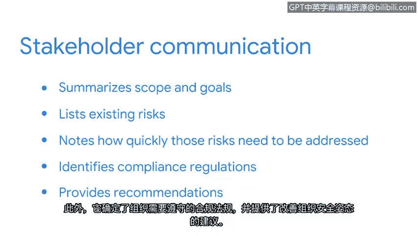

# 020：完成安全审核

在本节中，我们将学习如何完成一次内部安全审核。我们将重点介绍审核计划阶段之后的三个核心要素：控制措施评估、合规性评估以及结果沟通。通过本节的学习，你将了解作为一名初级安全分析师，在审核收尾阶段需要完成的具体任务。

上一节我们讨论了内部安全审核的初步规划要素。本节中，我们将介绍初级分析师可能需要完成的后续要素。

回顾一下，内部安全审核的规划要素包括：**确定范围与目标**，然后进行**风险评估**。剩下的三个要素是：**完成控制措施评估**、**评估合规性**以及**沟通结果**。

在完成最后这三个要素之前，你需要重新审视审核的范围、目标以及风险评估结果，并向自己提出一些问题。例如：
*   本次审核旨在达成什么目标？
*   哪些资产面临的风险最高？
*   现有的控制措施是否足以保护这些资产？
*   如果不足，需要实施哪些控制措施和合规性法规？

思考这些问题有助于你完成下一个要素：控制措施评估。

控制措施评估需要仔细审查组织现有的资产，然后评估这些资产面临的潜在风险，以确保内部控制和流程是有效的。

以下是初级分析师可能需要完成的任务，即将控制措施分为以下几类：

*   **管理控制**：这类控制与网络安全中的人力因素相关。它包括定义组织如何管理数据的政策和程序，例如实施密码策略。
*   **技术控制**：这类控制是用于保护资产的硬件和软件解决方案，例如使用入侵检测系统或加密技术。
*   **物理控制**：这类控制是指为防止对受保护资产进行物理访问而采取的措施，例如监控摄像头和门锁。

下一个要素是确定组织是否遵守了必要的合规性法规。

回顾一下，合规性法规是组织为确保私人数据安全而必须遵守的法律。

在本示例中，该组织在欧盟开展业务并接受信用卡支付，因此它需要遵守 **GDPR** 和 **支付卡行业数据安全标准**。

内部安全审核的最后一个常见要素是沟通。

一旦内部安全审核完成，需要将结果和建议传达给相关方。通常，这类沟通会总结审核的范围和目标，然后列出已识别的风险，并注明这些风险需要被解决的速度。此外，它还会明确组织需要遵守的合规性法规，并为改善组织的安全状况提供建议。

内部审核是发现组织内部安全漏洞的有效方法。在我之前工作的公司，我和我的团队进行了一次内部密码审核，发现许多密码强度不足。一旦我们识别出这个问题，合规团队便牵头开始执行更严格的密码策略。

审核是一个机会，可以确定组织已具备哪些安全措施，以及哪些领域需要改进以实现组织期望的安全状态。安全审核过程虽然复杂，但对组织具有极高的价值。在本课程后续部分，你将有机会为一家虚构公司完成内部安全审核的部分要素，这可以作为你职业作品集的一部分。

在本节课中，我们一起学习了如何完成内部安全审核。我们详细探讨了控制措施评估、合规性评估以及结果沟通这三个关键步骤。掌握这些知识，将帮助你作为一名初级安全分析师，有效地参与并支持组织的安全风险管理流程。