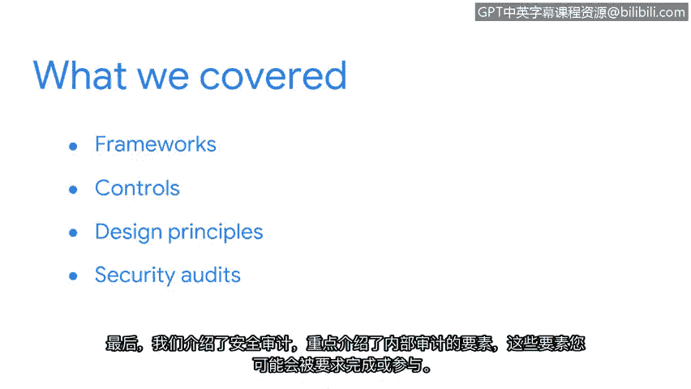

# 021：安全风险管理总结

在本节课中，我们学习了帮助组织保护数据和资产的关键安全概念。这些知识将为你进入安全专业领域打下坚实的基础。

## 课程回顾

上一节我们介绍了多种安全工具，本节我们来回顾本课程涵盖的核心安全概念。

我们首先定义了**安全框架**，并解释了它们如何帮助组织保护关键信息。

接着，我们探讨了**安全控制措施**及其在防范风险、威胁和漏洞方面的重要作用。这包括对核心安全模型**CIA三元组**的讨论，以及两个NIST框架：**网络安全框架**和**SP 800-53**。

然后，我们介绍了**OWASP安全设计原则**中的部分内容。

最后，我们引入了**安全审计**，重点介绍了你可能需要完成或参与的内部审计的要素。

## 核心概念与工具

以下是本课程涉及的核心模型与框架：

*   **CIA三元组**：这是信息安全的基石模型，代表**机密性**、**完整性**和**可用性**。
*   **NIST网络安全框架**：一个广泛采用的框架，帮助组织管理网络安全风险。
*   **NIST SP 800-53**：一套为联邦信息系统提供安全控制措施的综合指南。
*   **OWASP安全设计原则**：一系列指导安全系统设计的最佳实践。

## 知识的应用与展望

安全专业人员运用我们讨论的这些概念来帮助保护组织的资产、数据、系统和人员。在你进入安全专业领域的过程中，许多这些概念会反复出现。我们现在所做的是为你提供安全实践和主题的基础理解，这将对你未来的发展有所帮助。

在课程的下一部分，我们将讨论你未来作为分析师可能使用的具体安全工具。我们将介绍它们如何用于改善组织的安全状况，以及它们如何帮助你实现保护组织和人员安全的目标。

## 总结

本节课中，我们一起学习了安全框架、控制措施、核心模型以及审计流程。这些是构建有效安全策略和管理风险的基础模块。期待与你继续这段学习旅程，我们很快再见。