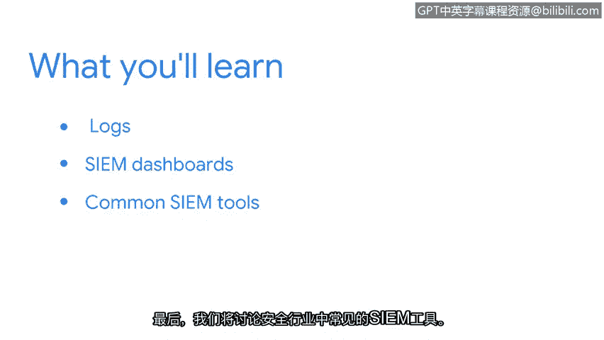

# 022：安全工具入门 🛠️

在本节课中，我们将要学习安全专业人员如何利用各种工具来应对特定的安全挑战，例如收集安全数据、检测分析威胁以及自动化任务。这些工具有助于组织构建更全面的安全态势。

上一节我们介绍了安全框架、控制措施和设计原则。本节中，我们来看看安全专业人员在实际工作中使用的一些关键工具。

## 日志类型与用途 📝

安全工具的基础之一是日志。日志是系统、应用程序或网络设备自动生成的记录文件，用于追踪发生的事件。

以下是几种常见的日志类型及其作用：

*   **系统日志**：记录操作系统级别的事件，如用户登录、系统启动和关闭。
*   **应用程序日志**：由特定软件生成，记录其运行状态、错误和用户活动。
*   **安全日志**：专门记录与安全相关的事件，例如失败的登录尝试、权限变更和策略违反。
*   **网络日志**：由防火墙、路由器等网络设备产生，记录网络流量、连接尝试和潜在攻击。

这些日志是进行安全监控和事件调查的原始数据来源。

## 安全信息与事件管理仪表盘 📊

仅仅拥有日志数据是不够的。为了高效地分析海量信息，安全专业人员使用**安全信息与事件管理**系统。

SIEM 的核心功能可以概括为以下公式：
`SIEM = 安全信息收集 + 事件关联分析 + 实时仪表盘展示`

SIEM 仪表盘将来自不同来源的日志数据聚合起来，进行关联分析，并以可视化的方式呈现，帮助安全团队快速识别异常模式和潜在威胁。

## 常见的 SIEM 工具 🧰

了解了 SIEM 的概念后，我们来看看行业中一些常用的 SIEM 工具。它们的功能和复杂度各不相同，适用于不同规模的组织。

以下是部分常见的 SIEM 工具示例：

*   **Splunk**：一个强大的数据平台，广泛用于日志搜索、监控和分析。
*   **IBM QRadar**：提供高级安全智能，能够关联来自数千个设备的事件。
*   **ArcSight**：以其强大的事件关联引擎和合规性报告功能而闻名。
*   **开源工具**：例如 **ELK Stack**，它由 Elasticsearch、Logstash 和 Kibana 组成，是一个流行的日志管理解决方案。

选择哪种工具取决于组织的具体需求、技术栈和预算。

本节课中，我们一起学习了安全工具的基础知识。我们了解了不同类型的日志及其用途，探讨了 SIEM 系统如何通过仪表盘整合与分析安全数据，并介绍了几种业界常见的 SIEM 工具。掌握这些工具是有效实施安全监控和威胁响应的关键一步。