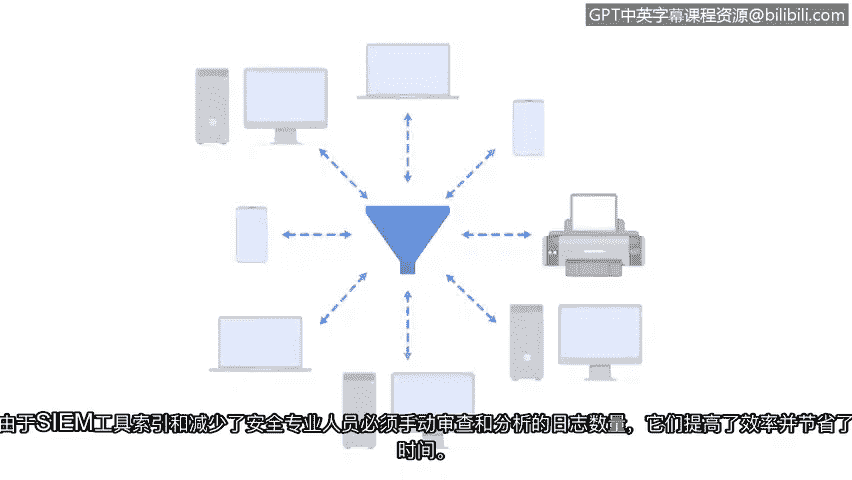

# 023：日志与SIEM工具

在本节课中，我们将要学习日志的基础知识以及安全信息与事件管理工具的作用。我们将了解常见的日志来源，并探讨SIEM工具如何帮助安全分析师高效地监控和应对安全威胁。

## 日志概述

作为安全分析师，您的职责之一可能包括分析日志数据，以缓解和管理威胁、风险和漏洞。

需要记住，**日志**是组织系统和网络内发生事件的记录。安全分析师需要访问来自不同来源的各种日志。

以下是三种常见的日志来源：

*   **防火墙日志**：记录来自互联网的入站流量尝试或已建立的连接，同时也记录网络内部向互联网发出的出站请求。
*   **网络日志**：记录所有进入和离开网络的计算机和设备，同时也记录网络上设备与服务之间的连接。
*   **服务器日志**：记录与网站、电子邮件或文件共享等服务相关的事件，包括登录、密码和用户名请求等操作。

通过监控如上图所示的日志，安全团队可以识别漏洞和潜在的数据泄露。

## SIEM工具简介

理解日志非常重要，因为SIEM工具依赖日志来监控系统并检测安全威胁。

**安全信息与事件管理工具**，或称**SIEM工具**，是一种收集和分析日志数据以监控组织关键活动的应用程序。

SIEM工具提供实时可见性、事件监控与分析以及自动化警报。它还将所有日志数据存储在集中位置。

由于SIEM工具会对日志进行索引并减少安全专业人员必须手动审查和分析的日志数量，因此它们提高了效率并节省了时间。

## SIEM工具的配置与定制

但是，SIEM工具必须经过配置和定制，以满足每个组织独特的安全需求。

随着新的威胁和漏洞不断出现，组织必须持续定制其SIEM工具，以确保威胁能够被检测到并得到快速处理。

在本证书课程的后续部分，您将有机会练习使用不同的SIEM工具来识别潜在的安全事件。

接下来，我们将探索SIEM仪表板，以及网络安全专业人员如何使用它们来监控威胁、风险和漏洞。

---

本节课中我们一起学习了日志的三种主要来源（防火墙、网络和服务器日志），并了解了SIEM工具如何通过集中收集、分析和警报日志数据来提升安全监控的效率和响应速度。我们还认识到，为了有效应对不断演变的威胁，对SIEM工具进行持续配置和定制至关重要。