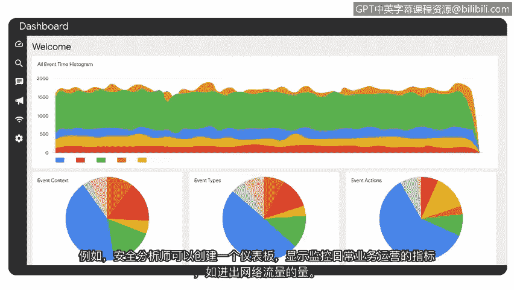

# 024：SIEM仪表板

在本节课中，我们将要学习SIEM工具的另一个重要功能：仪表板。我们将探讨仪表板如何以直观的图表形式呈现安全数据，帮助安全分析师快速识别威胁并做出决策。

## 仪表板概述

上一节我们介绍了SIEM工具如何收集和分析日志数据。然而，这只是SIEM在网络安全中的众多用途之一。SIEM工具还可以用来创建仪表板。

你可能在手机或其他设备的应用程序中遇到过仪表板。它们以易于理解的格式呈现关于你的账户或位置的信息。例如，天气应用程序使用图表、图形和其他视觉元素来显示温度、降水量、风速和预报等数据。这种格式使你能够快速识别天气模式和趋势，从而做好准备并相应地计划你的一天。

## SIEM仪表板的作用

就像天气应用帮助人们基于数据做出快速、明智的决策一样，SIEM仪表板帮助安全分析师以图表、图形或表格的形式快速、轻松地访问其组织的安全信息。

以下是SIEM仪表板的一个典型应用场景：
*   例如，一名安全分析师收到一个关于可疑登录尝试的警报。
*   该分析师访问其SIEM仪表板以收集有关此警报的信息。
*   通过使用仪表板，分析师发现尤拉的账户在五分钟内发生了500次登录尝试。
*   他们还发现，这些登录尝试发生的地理位置超出了尤拉通常的位置，也超出了她通常的工作时间。

通过使用仪表板，安全分析师能够快速查看登录尝试时间线、位置和活动确切时间的可视化呈现，然后确定该活动是可疑的。

## 仪表板的定制化与指标

除了提供安全相关数据的全面摘要外，SIEM仪表板还为利益相关者提供不同的**指标**。

**指标**是关键的技术属性，例如**响应时间、可用性和故障率**，用于评估软件应用程序的性能。

SIEM仪表板可以进行定制，以显示与组织中不同成员相关的特定指标或其他数据。例如，安全分析师可以创建一个仪表板，用于显示监控日常业务运营的指标，如**进出网络流量的量**。

## 总结

本节课中我们一起学习了SIEM仪表板的功能。我们探讨了安全分析师如何使用SIEM仪表板，通过可视化的数据呈现来快速识别异常活动（如可疑登录），从而帮助组织维持其安全态势。我们还了解了仪表板可以定制化显示关键性能指标，以满足不同角色的需求。

干得好。

接下来，我们将讨论网络安全行业中一些常见的SIEM工具，我们下一节见。