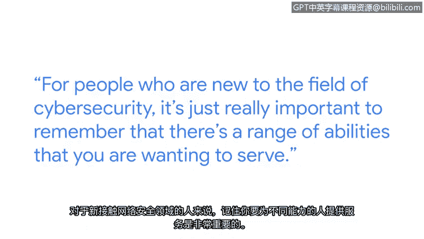

# 025：可访问性与安全性的相似之处 🎯

在本节课中，我们将跟随谷歌Chrome团队工程副总裁帕里萨的分享，探讨可访问性与网络安全之间的重要联系。我们将理解为何在设计安全措施时必须考虑不同用户的能力差异，并学习如何将这种包容性思维应用到网络安全实践中。

---

我的名字是帕里萨，我是工程副总裁，并负责领导Chrome团队。

作为Chrome团队的总经理，我领导着一个由全球工程师、产品经理和设计师组成的团队，共同构建Chrome浏览器并确保所有用户的安全。

我认为可访问性对技术的各个方面都至关重要。

当我们思考它与网络安全的相关性时，我们最终的目标是保护每个人的安全。

我将可访问性理解为，使信息、活动甚至环境对尽可能多的人而言有意义、可感知且可用。

当我们从技术角度讨论这一点时，它通常是指让残障人士也能获取信息或服务。

我们基于自身能力做出的安全增强决策，实际上可能对他人无效。

例如，你有时会看到用红色来表示警告，但对于色盲人士来说，这种方式将是无效的。因此，在我们试图保护人们安全时，充分考虑可访问性，对于措施的有效性至关重要。

我在安全领域工作了很长时间，确实看到了这两个领域之间的一些相似之处。

当你试图解决一个非常具体的安全问题或可访问性问题时，我确实看到了创新被驱动。

隐藏式字幕最初是为了帮助听力障碍人士而设计和构建的，但最终它帮助了所有人。

对于网络安全领域的新手来说，非常重要的一点是记住，你希望服务的用户拥有不同的能力范围。

---

上一节我们了解了可访问性的基本概念，接下来我们看看如何将其原则应用到安全实践中。

获取用户研究和反馈，并在测试安全缓解措施有效性时涵盖不同能力范围，这一点非常重要。

我知道在早期这对我来说很可怕，我看起来和其他人不一样，我真的很挣扎于自己是否属于这里。

找到可以成为导师的人，鼓起勇气提问，并认识到你很少是唯一有那个问题的人，有时只是坚持度过艰难时刻，就能带来突破，也能增长信心。

我学到的一件事是，我拥有与这个领域其他人不同的背景，这恰恰是我的超能力。

我不应专注于我与房间里“常态”之间的差距，而应该为我自身的独特性，以及我为团队带来的独特技能和视角感到自豪。

---

本节课中我们一起学习了可访问性与网络安全之间的深刻联系。核心在于，**有效的安全设计必须是包容性的设计**。我们不能仅凭自己的经验假设所有用户都有相同的能力，而必须主动考虑多样性，通过**用户研究和包容性测试**来确保安全措施对每个人都有效。记住，独特的视角和背景是你的优势，它们能帮助你构建出更强大、更普适的安全解决方案。