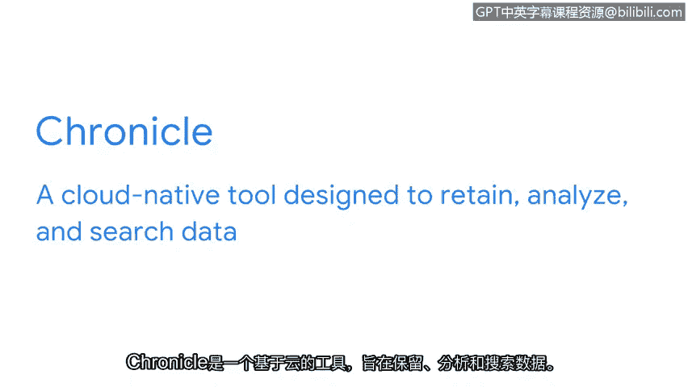

# 026：探索常见的SIEM工具 🔍

在本节课中，我们将要学习几种行业领先的安全信息与事件管理工具。了解这些工具的类型和特点，对于安全分析师监控系统、检测威胁至关重要。

上一节我们讨论了SIEM工具如何帮助安全分析师监控系统和检测安全威胁。本节中，我们来看看一些在行业中处于领先地位的SIEM工具，这些工具是安全分析师在工作中很可能会遇到的。

首先，我们来讨论组织根据其独特的安全需求可以选择的几种不同类型的SIEM工具。

以下是SIEM工具的三种主要部署类型：

*   **自托管SIEM工具**：这类工具要求组织使用自己的物理基础设施（如服务器容量）来安装、运行和维护。这些应用程序由组织内部的IT部门而非第三方供应商管理和维护。当组织需要对机密数据保持物理控制时，自托管SIEM工具是理想的选择。
*   **云托管SIEM工具**：这类工具由SIEM供应商维护和管理，可通过互联网访问。对于不想投资创建和维护自身基础设施的组织而言，云托管SIEM工具是理想的选择。
*   **混合解决方案**：组织也可以选择结合使用自托管和云托管的SIEM工具，这被称为混合解决方案。组织选择混合SIEM解决方案，是为了在利用云服务优势的同时，也能对机密数据保持物理控制。

Splunk Enterprise、Splunk Cloud和Chronicle是许多组织用来帮助保护其数据和系统的常见SIEM工具。

接下来，我们逐一了解这些具体的工具。让我们从Splunk开始讨论。Splunk是一个数据分析平台，其Splunk Enterprise产品提供了SIEM解决方案。

以下是Splunk系列工具的介绍：

*   **Splunk Enterprise**：这是一个自托管工具，用于保留、分析和搜索组织的日志数据，以实时提供安全信息和警报。
*   **Splunk Cloud**：这是一个云托管工具，用于收集、搜索和监控日志数据。对于那些运行混合云或纯云环境（即组织的部分或全部服务在云端）的组织来说，Splunk Cloud非常有帮助。

最后，我们来介绍谷歌的Chronicle。Chronicle是一个云原生工具，旨在保留、分析和搜索数据。

Chronicle提供日志监控、数据分析和数据收集功能。与云托管工具类似，云原生工具也完全由供应商维护和管理。但云原生工具是专门为充分利用云计算的各项能力（如可用性、灵活性和可扩展性）而设计的。

由于威胁行为者不断改进其策略，以破坏目标的机密性、完整性和可用性，因此组织使用多种安全工具来帮助防御攻击至关重要。我们刚刚讨论的SIEM工具只是安全团队可用于帮助防御其组织的众多工具中的几个例子。

在本证书课程的后续部分，你将有机会亲身体验使用Splunk Cloud和Chronicle，这是一个令人兴奋的实践机会。

本节课中，我们一起学习了SIEM工具的几种主要部署类型（自托管、云托管和混合方案），并介绍了Splunk Enterprise、Splunk Cloud和Google Chronicle这三款行业领先的SIEM工具及其特点。理解这些工具是构建有效安全监控能力的基础。