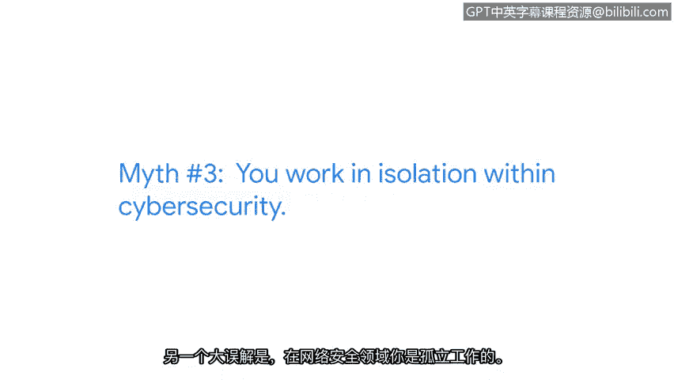

# 027：关于网络安全领域的误解

在本节课程中，我们将跟随谷歌隐私安全与防护团队的工程师塔利亚，一起探讨关于网络安全职业的几个常见误解。了解这些真相，将帮助你更清晰地规划自己的职业道路。

我是塔利亚，是谷歌隐私安全与防护部门的一名工程师。

网络安全领域存在很多误解。

## 误解一：必须精通编码、黑客技术或数学

一个很大的误解是，你必须会编程、必须懂黑客技术，或者必须是个数学天才。

**我不会编程**，尽管随着时间推移我学会了阅读代码。

**我不是黑客**。我不在安全领域的“红队”（攻击方），而更像是在“蓝队”（防御方）。

**我也不是数学天才**。我走的是商业路线，不是数学家，那并非我的道路。

因此，我的很多优势实际上在于**建立人际关系的能力**、**快速学习的能力**、**进行深入研究的能力**以及**提出正确问题的能力**。我认为这些才是我的最强项。

## 误解二：必须拥有网络安全学位

另一个重大误解是，你必须拥有网络安全学位。

我实际上在大学学的是商科。**学位并非必需**，尽管我后来确实回去深造了，但那是我个人的选择。

你不需要为了被视为网络安全领域的优秀候选人而去攻读这个学位。

## 误解三：网络安全工作意味着孤立

还有一个误解是，网络安全工作意味着孤立。

这实际上取决于你选择的道路，但我发现这**远非事实**。我的工作需要大量的团队协作与沟通。

## 核心建议：勇于开创自己的道路

我对任何对网络安全感兴趣的人的最大建议是：**勇于开创自己的道路**。

每个人的道路看起来都不同。如果你和五个不同的人交谈，他们的旅程都会各不相同。

在你的旅程中，**识别那些能够支持你的人**，让他们知道你在攻读这个证书，看看在你启程时能获得什么样的支持。

---

**总结**

本节课中，我们一起学习了关于网络安全职业的三个常见误解：

1.  网络安全不等于必须会编程、当黑客或精通数学，软技能同样至关重要。
2.  进入该领域并不强制要求拥有网络安全专业学位。
3.  网络安全工作并非孤立无援，团队合作是常态。

最重要的是，塔利亚鼓励我们**勇于开创属于自己的独特职业道路**，并积极寻求支持。记住，你的技能、热情和学习能力才是成功的关键。