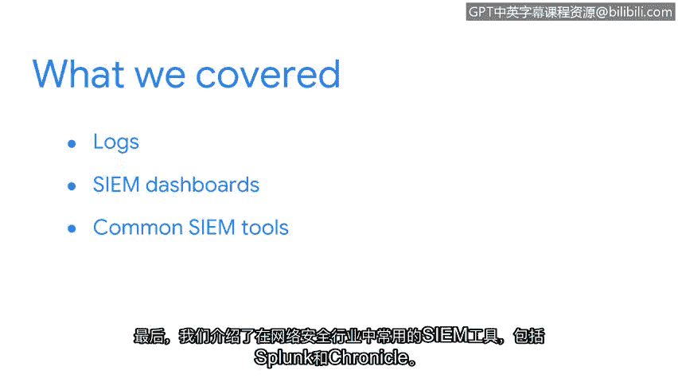

# 028：总结

在本节课程中，我们回顾了日志管理、安全仪表盘和常见安全信息与事件管理工具的核心内容。

## 课程回顾

上一节我们介绍了安全信息与事件管理工具，本节我们来总结本模块的核心要点。

我们首先讨论了日志在网络安全中的重要性。

以下是几种关键的日志类型：
*   **防火墙日志**：记录网络边界上的允许和拒绝的流量。
*   **网络日志**：记录网络设备（如路由器和交换机）的活动。
*   **服务器日志**：记录服务器操作系统和应用程序的事件。

接下来，我们探讨了SIEM仪表盘。这些仪表盘使用图表和图形等**可视化**方式，为安全团队提供关于组织安全状况的快速、清晰的洞察。

最后，我们介绍了网络安全行业中常用的SIEM工具。

以下是两个主流的SIEM工具示例：
*   **Splunk**：一个广泛使用的平台，用于搜索、监控和分析机器生成的数据。
*   **Chronicle**：谷歌云旗下的安全分析平台，专注于大规模威胁检测。

## 后续展望

在本课程后续部分，我们将探索更多的安全工具，并提供实践使用的机会。

紧接着，我们将讨论**剧本**，以及它们如何帮助安全专业人员对已识别的威胁、风险和漏洞做出恰当的响应。我们下一节再见。

## 总结

本节课中，我们一起学习了网络安全中日志的核心作用、SIEM仪表盘的可视化价值，以及Splunk和Chronicle等常见SIEM工具。这些是安全风险监控与分析的基础组成部分。