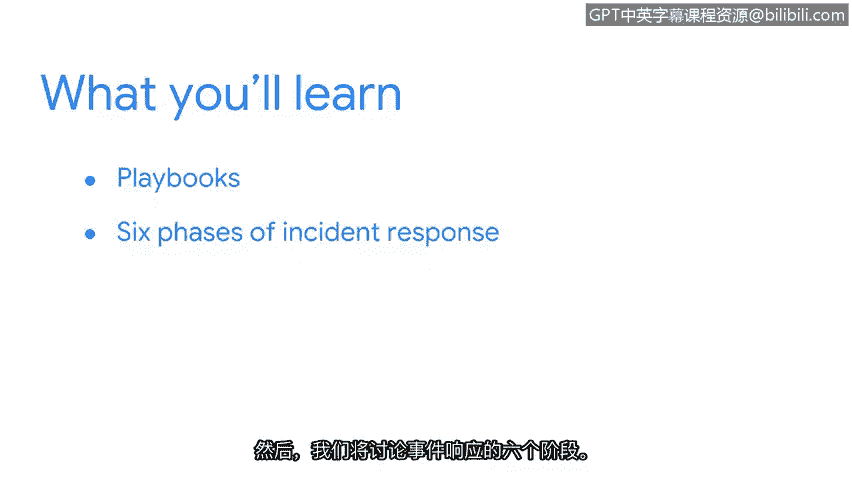

**谷歌网络安全专业证书：第二课：安全风险管理：P29：欢迎来到第四周**

在本节课中，我们将学习安全团队用于应对威胁和漏洞的重要工具——**剧本**。我们将探讨剧本如何与SIEM工具协同工作，并详细介绍事件响应的六个标准阶段。

---

上一节我们讨论了安全信息与事件管理工具及其如何帮助组织提升安全态势。本节中，我们将继续探索安全专业人员使用的另一个关键工具：**剧本**。

剧本是安全团队遵循的详细行动指南，用于应对SIEM工具识别出的威胁、风险或漏洞。它们确保响应行动一致、高效且可重复。

以下是剧本通常包含的核心组成部分：

*   **目标**：明确说明剧本旨在解决的具体安全事件或问题。
*   **触发条件**：定义启动该剧本所需满足的特定警报或条件。
*   **所需工具**：列出执行剧本步骤所需的软件、访问权限或其他资源。
*   **行动步骤**：按顺序详细说明响应团队需要执行的具体操作。
*   **结果与报告**：说明事件处理完毕后需要记录的信息和生成的报告。

为了系统化地处理安全事件，行业普遍采用结构化的事件响应流程。该流程通常包含六个阶段。

以下是事件响应的六个阶段：

1.  **准备**：此阶段是基础，涉及制定事件响应计划、组建团队、准备工具和资源，并进行培训与演练。
2.  **检测与分析**：在此阶段，团队通过监控工具（如SIEM）发现潜在安全事件，并收集数据进行分析以确认其性质、范围和影响。
3.  **遏制、根除与恢复**：这是核心响应阶段。**遏制**指采取措施防止事件扩大；**根除**指找到并彻底移除事件的根本原因；**恢复**指将受影响的系统和服务安全地恢复到正常运营状态。
4.  **事后总结**：事件处理后，团队会回顾整个响应过程，分析哪些做得好、哪些需要改进，并更新剧本和计划。
5.  **协调**：此阶段强调在整个响应过程中，与组织内部其他部门（如法律、公关）及外部相关方（如执法机构）进行有效沟通与协作。
6.  **合规**：确保整个事件响应过程符合相关的法律、法规及行业标准的要求。

---

本节课中，我们一起学习了安全**剧本**的概念及其组成部分，并系统了解了事件响应的六个标准阶段：准备、检测与分析、遏制根除与恢复、事后总结、协调与合规。掌握这些知识有助于构建系统化、高效的安全事件应对能力。