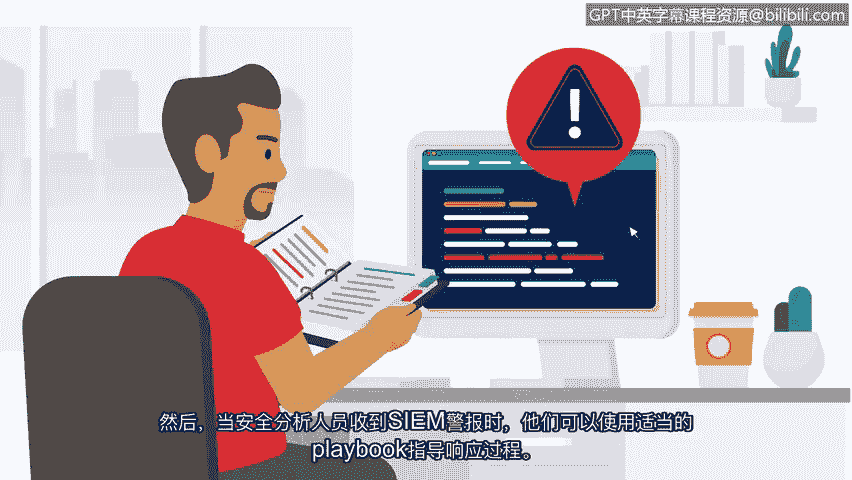

# 030：P30 事件响应手册的阶段 🛡️

在本节课中，我们将要学习一个在网络安全领域至关重要的工具——事件响应手册。我们将了解它的定义、重要性，并详细拆解其包含的六个核心阶段。

## 概述

上一节我们介绍了SIEM工具如何帮助保护组织的关键资产和数据。本节中，我们来看看另一个用于维护组织安全的重要工具——手册。

手册是一份提供任何操作行动细节的指南。在安全领域，手册明确了应对安全事件时应使用何种工具。手册至关重要，因为快速识别并缓解安全威胁需要紧迫性、效率和准确性，以降低潜在风险。手册确保无论由谁处理事件，人们都能按照规定的、一致的行动列表来操作。

有多种类型的手册，包括用于事件响应、安全警报、特定团队和特定产品的手册。这里我们将重点介绍网络安全中常用的一种手册，称为事件响应手册。

事件响应是组织快速识别攻击、控制损害并纠正安全漏洞影响的尝试。事件响应手册是一个包含六个阶段的指南，用于帮助从头到尾缓解和管理安全事件。

## 事件响应手册的六个阶段

以下是事件响应手册的六个关键阶段。

### 第一阶段：准备

组织必须通过记录程序、建立人员配置计划以及教育用户，为缓解安全事件的可能性、风险和影响做好准备。准备为成功的事件响应奠定基础。

例如，组织可以创建事件响应计划和程序，概述每个安全团队成员的**角色和职责**。

### 第二阶段：检测与分析

此阶段的目标是使用定义的流程和技术来检测和分析事件。在此阶段使用适当的工具和策略，有助于安全分析师确定是否发生了违规行为，并分析其可能的影响范围。

### 第三阶段：遏制

遏制的目标是防止进一步的损害，并减少安全事件的直接影响。在此阶段，安全专业人员采取行动遏制事件并最小化损害。遏制对组织来说是高度优先的事项，因为它有助于防止对关键资产和数据的持续风险。

### 第四阶段：根除与恢复

此阶段涉及完全清除事件的痕迹，以便组织能够恢复正常运营。在此阶段，安全专业人员通过**移除恶意代码**和**修复漏洞**来消除事件的痕迹。一旦他们履行了应尽的职责，就可以开始将受影响的环境恢复到安全状态。这也被称为IT恢复。

### 第五阶段：事后活动

此阶段包括记录事件、通知组织领导层，并应用经验教训，以确保组织能更好地应对未来事件。根据事件的严重程度，组织可以进行全面的事件分析，以确定事件的根本原因，并实施各种更新或改进，以增强其整体安全态势。

### 第六阶段：协调

协调涉及根据组织既定的标准，在整个事件响应过程中报告事件和共享信息。协调非常重要，原因有很多。它确保组织满足合规要求，并允许进行协调的响应和解决。

## 工具协同与总结

安全专业人员可以通过多种方式获知事件。您最近学习了SIEM工具及其如何收集和分析数据。它们利用这些数据检测威胁并生成警报，从而通知安全团队潜在事件。然后，当安全分析师收到类似的警报时，他们可以使用相应的事件响应手册来指导响应流程。

**SIEM工具和手册协同工作**，为响应潜在安全事件提供了一种结构化且高效的方式。在整个课程中，您将有机会继续加深对这些重要概念的理解。

本节课中，我们一起学习了事件响应手册的六个核心阶段：准备、检测与分析、遏制、根除与恢复、事后活动以及协调。理解并遵循这些阶段，是有效管理和缓解安全事件的关键。