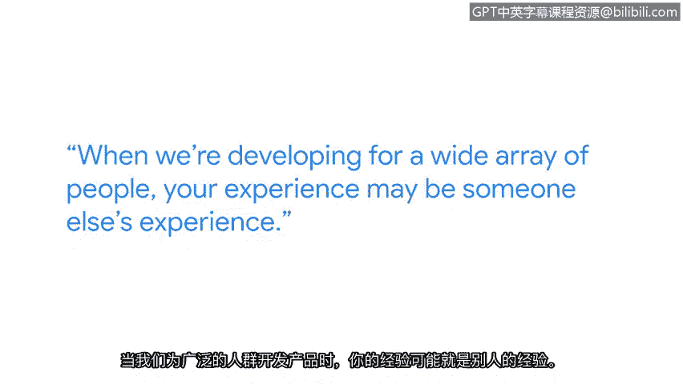

# 033：安全团队多样性的重要性 👥

## 概述
在本节课程中，我们将跟随谷歌隐私工程师艾琳，探讨安全与隐私团队中多样性的核心价值。我们将了解，构建安全可靠的技术产品不仅需要技术专长，更需要多元化的视角和生活经验。

## 正文

大家好，我是艾琳，目前在谷歌担任隐私工程师。

我的工作聚焦于前瞻性与新兴技术领域，主要研究那些尚未面世、预计在未来两到五年内出现的技术。我的职责是审视我们正在创造的所有技术，并确保隐私保护理念被嵌入其中。我的思考始于用户接触产品之前，确保他们在使用产品时，能够信任与产品的互动，并知晓我们正在保护他们的隐私——那些他们不愿分享或公开的信息——确保他们在接触产品前就已充分知情。

我一直强调，软技能比技术技能更为重要。因为技术可以传授，但如何与人建立联系、理解他人是无法教授的，这是你自身带来的独特价值。思维的多样性和视角的多元性，对于我们理解所处的世界非常有用。

既然我们是为普罗大众设计产品，就需要大众来帮助我们理解这些多元视角。我可能以一种方式看待事物，但我的同事基于其自身经历可能会有不同的看法。当来自不同背景的你们协同工作时，实际上能为所审视的事物带来更广泛的代表性和更深刻的见解。

你所带来的视角，是让产品变得更好的关键声音。例如，看看那些从事新闻工作的人，或者像我一样曾在娱乐行业工作过的人，他们带来了解决问题的新颖视角。假设我们有一个产品方案，需要说服产品团队“也许我们不该这么做”，这时如果说“从一位前新闻从业者的角度看，我们真的希望这个功能登上《纽约时报》的头条吗？很可能不希望”，这就是一种能让一线团队成员深刻理解其后果的有效沟通方式。

你从出生至今所拥有的全部经历，构成了你独一无二的经验。在面向广大人群进行技术开发时，我们必须考虑到这一点。你的经验，很可能也是他人的经验。因此，如果房间里没有你，我们就失去了为整个等式增添一份美好元素的机会。

正因如此，我鼓励大家：请加入我们，投身于技术领域，参与到STEM（科学、技术、工程、数学）中来。因为无论是产品、安全、隐私，还是软件工程等任何领域，广泛的代表性都至关重要。

## 总结
本节课我们一起学习了安全与隐私团队中多样性的重要性。我们认识到，多元化的背景和视角是构建可信、包容技术产品的关键。技术能力可以学习，但每个人独特的生活经验和思维方式是不可替代的宝贵资产，它们能帮助团队预见风险、理解用户，并创造出更负责任、更优秀的产品。