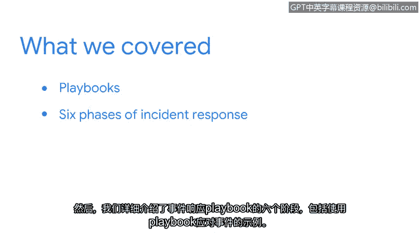

# 034：总结

在本节课程中，我们回顾了安全事件响应手册的核心内容。我们将总结手册的目的、六个阶段及其重要性，以巩固你的理解。

## 回顾手册的目的

上一节我们介绍了安全事件响应手册的基本概念。手册的核心目的是为安全分析师提供一套结构化的、一致的流程，用于处理各类安全事件。其目标是帮助团队快速响应，并最大限度地减少事件对组织及其服务对象造成的潜在影响和损害。

## 事件响应手册的六个阶段

以下是事件响应手册通常包含的六个关键阶段，我们将逐一回顾：

1.  **准备**：此阶段涉及建立响应能力，例如组建团队、制定政策和获取必要工具。
2.  **检测与分析**：此阶段专注于识别潜在的安全事件并确定其性质和范围。
3.  **遏制、根除与恢复**：此阶段旨在限制事件影响、消除威胁根源，并使系统恢复正常运行。
4.  **事后总结**：在事件处理后，团队需回顾整个过程，总结经验教训，并改进未来的响应计划。

## 手册的应用与价值

手册是安全分析师必备的关键工具之一。遵循手册的步骤并与团队进行适当沟通，将确保你作为一名安全专业人员的有效性。知道如何以及何时使用手册，能使你在安全事件发生时，就如何响应做出明智的决策。

---

本节课中，我们一起学习了安全事件响应手册的完整框架。我们明确了手册旨在提供结构化方法以快速处理事件，并详细回顾了其包含的六个核心阶段：准备、检测与分析、遏制、根除、恢复及事后总结。掌握手册的应用，对于有效应对安全事件、保护组织安全至关重要。