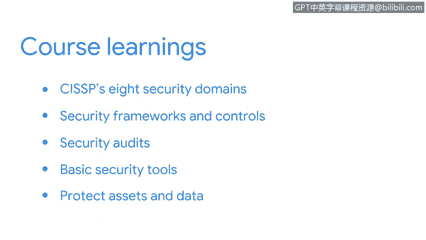

**网络安全风险管理：课程总结**

在本课程中，我们系统性地学习了网络安全风险管理的基础知识。现在，让我们回顾一下所涵盖的核心内容。

首先，我们回顾了CISSP的8个安全域，并将重点放在了可能影响业务运营的**威胁**、**风险**和**漏洞**上。

随后，我们探讨了安全框架与控制措施，理解了它们是如何作为制定安全管理**策略**和**流程**的起点。这包括了对**CIA三元组**（机密性、完整性、可用性）、**NIST框架**以及**安全设计原则**的讨论，并分析了它们如何使整个安全社区受益。

在理解了框架和原则之后，我们进一步探讨了它们与**安全审计**之间的关系。

接着，我们探索了基本的安全工具，例如**SIEM仪表盘**，并了解了它们如何被用于保护业务运营。

最后，我们学习了如何通过使用**应急预案手册**来保护资产和数据。

作为一名安全分析师，你可能需要同时处理多项任务。理解你所掌握的工具及其使用方法，将提升你在此领域的专业知识，并帮助你成功完成日常工作。

在接下来的课程中，我的同事Chris将为本课程所涵盖的主题提供更多细节，并向你介绍一些新的核心安全概念。

很高兴能与你一同走过这段学习旅程。