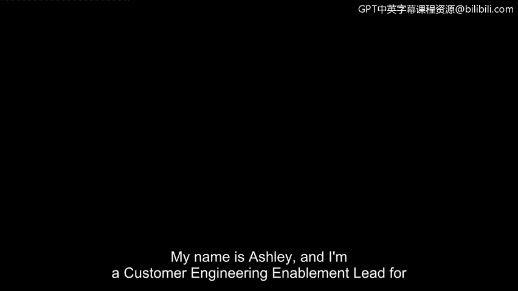
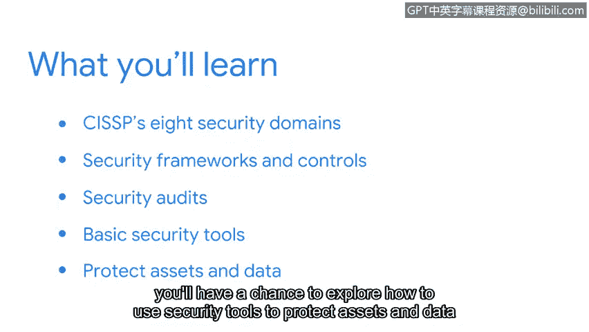

**谷歌网络安全专业证书课程：第二课：安全风险管理概述**

在本课程中，我们将深入学习安全风险管理的核心概念，包括安全框架、控制措施、安全审计以及基本安全工具。这些知识对于保护组织免受威胁至关重要。

---

**回顾与衔接**

上一节我们介绍了安全的基本定义、入门级分析师职责以及安全领域的演进历史。本节中，我们将正式开启第二课《安全风险管理》的学习。

我是Ashley，在谷歌担任安全运营销售部门的客户工程赋能主管。我很荣幸能担任本课程的讲师。

首先，我们快速回顾已学内容。此前，我们定义了安全，并探讨了入门级分析师的一些常见职责。我们还讨论了分析师需要培养的核心技能与知识。接着，我们分享了“爱虫”病毒和莫里斯蠕虫等关键事件，这些事件推动了安全领域的发展与持续演进。我们也向大家介绍了用于降低风险的框架、控制措施和CIA三要素（机密性、完整性、可用性）。

---

**本课程核心内容**

在本课程中，我们将深入探讨以下主题：
*   **CISSP八大安全域**：了解认证信息系统安全专家的知识体系框架。
*   **安全框架与控制措施**：更详细地探讨安全框架与控制，重点是美国国家标准与技术研究院的风险管理框架。
*   **安全审计**：探索安全审计，包括内部审计的常见要素。
*   **基本安全工具**：介绍一些基本的安全工具，您将有机会探索如何使用这些工具来保护资产和数据免受威胁、风险和漏洞的影响。

---

**学习动机与重要性**

保护组织及其资产免受威胁、风险和漏洞的侵害，是维持业务运营的重要步骤。根据我作为安全分析师的经验，我曾协助应对一次严重的违规事件，该事件给组织造成了近25万美元的损失。因此，我希望大家能保持动力，继续您的安全学习之旅。我已经迫不及待了，让我们开始吧。

---

**总结**

本节课中，我们一起回顾了前期基础，并概述了《安全风险管理》课程将要涵盖的核心内容：CISSP安全域、NIST风险管理框架、安全审计以及基本安全工具。掌握这些知识是构建有效安全防御体系的第一步。