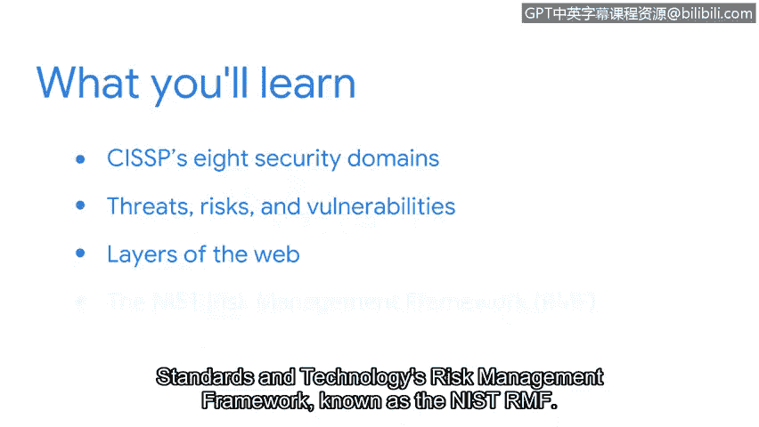

# 037：欢迎来到第一周 🛡️

在本节课中，我们将学习网络安全领域的核心知识框架，包括安全域、威胁、风险、漏洞以及风险管理的基本方法。这些内容是构建安全专业能力的基础。

## 概述

网络安全领域非常广阔。确保你拥有成功驾驭这个领域所需的知识、技能和工具，正是我们在此学习的目的。在接下来的视频中，你将了解CISSP的八个安全域的重点。然后我们将更详细地讨论威胁、风险和漏洞。我们还将向你介绍网络的三层结构，并分享一些示例，以帮助你理解本课程中将讨论的不同类型的攻击。最后，我们将研究如何使用美国国家标准与技术研究院的风险管理框架来管理风险。

因为这些主题及相关技术技能被认为是安全领域的核心知识，持续加深对它们的理解将帮助你缓解和管理组织日常面临的风险与威胁。

## 安全域简介

上一段我们概述了本周的学习目标。本节中，我们来看看构成网络安全知识体系的基础框架——安全域。

在下一个视频中，我们将进一步讨论在第一门课程中介绍的八个安全域的重点。