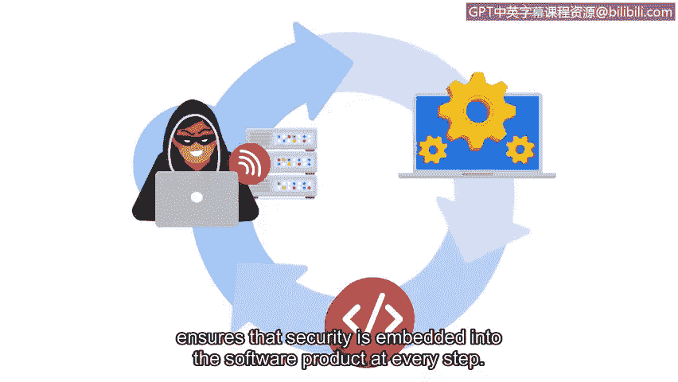

# 039：探索CISSP安全域（第二部分）🔐

在本节课程中，我们将学习CISSP安全框架的最后四个核心领域。这些领域涵盖了从身份验证到软件开发的完整安全生命周期，是构建组织整体安全策略的基础。

上一节我们介绍了前四个安全域，本节中我们来看看剩下的四个：身份与访问管理、安全评估与测试、安全运营以及软件开发安全。

## 身份与访问管理（IAM）👤

身份与访问管理（IAM）专注于通过确保用户遵循既定策略来控制和访问资产，从而保障数据安全。其核心目标是**降低系统和数据的整体风险**。

例如，如果公司所有人都使用同一个管理员账户登录，就无法追踪谁访问了哪些数据。一旦发生安全事件，将无法区分合法用户活动与威胁行为者的行为。

IAM包含四个主要组成部分：

以下是身份与访问管理的四个核心组件：

*   **身份识别**：用户通过提供用户名、门禁卡或指纹等生物特征数据来声明其身份。
*   **身份验证**：验证用户身份的过程，例如输入密码或PIN码。
*   **授权**：在用户身份确认后，根据其在组织中的角色，确定其访问权限级别。
*   **可问责性**：监控和记录用户行为（如登录尝试），以证明系统和数据被正确使用。

## 安全评估与测试🔍

安全评估与测试领域侧重于进行安全控制测试、收集分析数据以及执行安全审计，以监控风险、威胁和漏洞。

定期进行安全控制测试能帮助组织找到缓解威胁、风险和漏洞的更好方法。这涉及检查组织目标，并评估现有控制措施是否真正实现了这些目标。

同样，定期收集和分析安全数据也有助于预防组织的威胁和风险。安全分析师可能会利用安全控制测试评估和安全评估报告来改进现有控制措施，或实施新的控制措施。

例如，实施一项新控制措施可以是要求使用**多因素认证（MFA）**，以更好地保护组织免受潜在的威胁和风险。

## 安全运营🚨

安全运营领域侧重于进行调查和实施预防措施。调查在安全事件被识别后立即开始，此过程需要高度的紧迫感，以最小化对组织的潜在风险。

如果存在主动攻击，缓解攻击并防止其升级对于保护私人信息免受威胁行为者侵害至关重要。一旦威胁被消除，将开始收集数字和物理证据以进行取证调查。

必须进行**数字取证调查**，以确定入侵发生的时间、方式和原因。这有助于安全团队确定需要改进的领域，并采取预防措施以减轻未来的攻击。

## 软件开发安全💻

软件开发安全领域侧重于使用安全编码实践。安全编码实践是用于创建安全应用程序和服务的推荐指南。

软件开发生命周期（SDLC）是团队用于快速构建软件产品和功能的高效流程。在此流程中，安全是一个额外的关键步骤。

通过确保软件开发生命周期的每个阶段都经过安全审查，可以将安全完全集成到软件产品中。例如：

以下是确保安全融入SDLC各阶段的示例：

*   在设计阶段执行**安全设计评审**。
*   在开发和测试阶段执行**安全代码评审**。
*   在部署和实施阶段执行**渗透测试**。

这些步骤确保了安全在每一步都嵌入到软件产品中，从而使软件保持安全、敏感数据得到保护，并减轻组织不必要的风险。

---

本节课中我们一起学习了CISSP安全框架的最后四个领域：身份与访问管理（IAM）、安全评估与测试、安全运营以及软件开发安全。熟悉这些领域可以帮助你更好地理解它们如何被用于提升组织的整体安全性，以及安全团队所扮演的关键角色。

接下来，我们将讨论安全威胁、风险和漏洞，包括勒索软件，并向你介绍网络的三个层次。