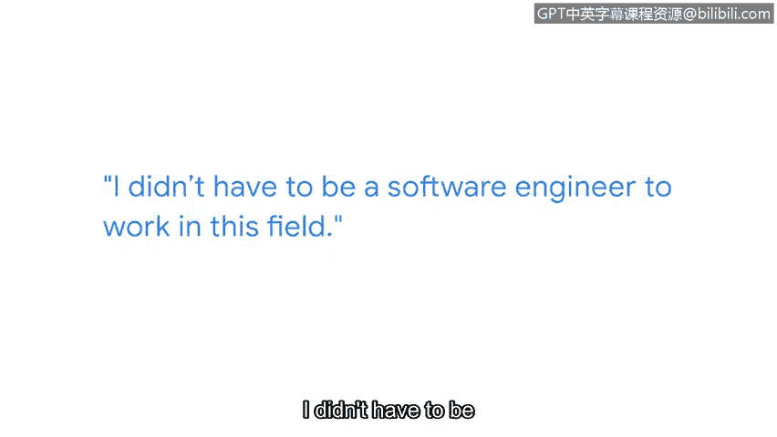

# 040：网络安全从业者的职业路径分享

在本节课中，我们将跟随谷歌员工Ashley的分享，了解她进入网络安全领域的非传统职业路径。她的经历将展示，进入这一行业并不总是需要直线式的规划，多样化的技能和经历同样宝贵。

## 个人背景与早期经历

我的名字是Ashley，我在谷歌的职位是Seop销售部门的客户工程师赋能负责人。我的主要工作是帮助为支持我们产品的客户工程师设立培训项目。

我从小就喜欢电脑和互联网。我拥有历史上最早的AOL屏幕名之一，并为此感到非常自豪。我的父亲是一名工程师，因此我一直对科技抱有浓厚兴趣。然而，高中毕业时，我并没有找到一条清晰的路径进入这个领域。

## 转折点与军旅生涯

我的成长道路并非一帆风顺。我在十年级时放弃了努力，在很长一段时间里对什么都漠不关心，并且经常惹麻烦。我告诉自己，如果不参军离开这里，继续这样下去，我可能两三年后就不在这里了。因此，高中毕业后，我在六月毕业，四天后就前往南卡罗来纳州的杰克逊堡新兵训练营报到，成为一名小号手。

## 初入职场与发现机遇

退伍回来后，我需要找一份工作。当时我甚至没有关注科技类的工作。我做过大型五金店的购物车回收员、卖过电子游戏、还在货运公司做过零售装箱工。在所有这些经历之后，我才意识到科技是一个可行的职业选项。

军队慷慨地为我提供了IT领域的再培训。这是我获得的第一波正式学校教育，让我至少能够说：“嘿，我具备了成为一名PC技术员的技能。”

## 教育与职业起步

我回到社区大学，并找到了一个网络安全副学士学位项目。我学习了一些认证课程，并参加了我的第一次Defcon大会，这是一个大型的黑客会议。这次经历让我豁然开朗，真正看清了未来的职业路径可能是什么样子。

我在2017年找到了第一份安全分析师的工作。我参加了上一家公司的一个退伍军人培训项目，该项目对退伍军人是免费的。我从培训中脱颖而出并被聘用，在那家公司工作了近五年，之后才来到谷歌。

## 给新人的核心建议

如果你是新入行者，你必须知道如何与团队合作。我认为我们很多人是在客户服务环境中学会这一点的。我在零售业工作中学到的一些技能，比如应对难缠的客户、学习如何与人沟通、甚至在人们不满时如何化解紧张局势，这些都非常有用。在IT领域，我们同样需要这些技能。这不再仅仅是技术能力，我们需要成为“T型人才”——即同时具备软技能、人际交往能力和技术技能。

你必须具备良好的分析能力。同样，这甚至不一定是技术分析。如果你能阅读一本书并剖析其中的修辞手法，你就能做分析工作。你不需要成为一名软件工程师才能进入这个领域。

## 克服障碍与保持开放心态

对我们许多人来说，数学恐惧和编程是很大的障碍。但我们的工作是与人打交道、与流程打交道。你并不一定需要编码知识来理解人或流程。进入这个领域有很多途径，所以不要气馁，也不要害怕跳出思维定式来获得入门的机会。

## 总结

本节课中，我们一起学习了Ashley从非传统路径进入网络安全行业的经历。她的故事强调了**软技能**、**持续学习**和**多样化经历**的重要性。关键启示在于：**职业路径 = 技术技能 + 人际技能 + 分析能力 + 开放心态**。进入网络安全领域没有单一固定的路线，勇于尝试并从各种经历中学习，是成功的关键。