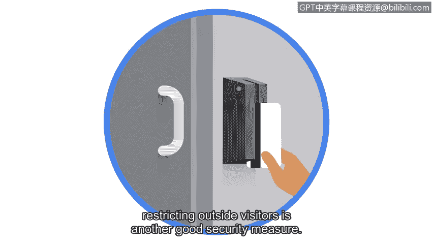

# 041：威胁、风险与漏洞 🔐

在本节课中，我们将学习网络安全领域的三个核心概念：威胁、风险与漏洞。我们将明确它们的定义、区别，并通过具体例子来理解它们如何影响组织的资产安全。

作为初级安全分析师，你的众多职责之一将是处理组织的数字和物理资产。需要记住，资产是指被组织认为具有价值的任何物品。在组织的生命周期中，会获取各种类型的资产，包括物理办公空间、计算机、客户个人身份信息、知识产权（如专利或受版权保护的数据）等等。

不幸的是，组织运营的环境中存在多种对其资产构成安全威胁、风险和漏洞的因素。接下来，我们来回顾一下威胁、风险与漏洞分别是什么，并讨论一些常见的例子。

## 威胁：潜在的负面事件 🚨

威胁是指任何可能对资产产生负面影响的状况或事件。

以下是威胁的一个例子：
*   **社会工程学攻击**：这是一种利用人为错误来获取私人信息、访问权限或贵重物品的操纵技术。其中一种被称为网络钓鱼的方法，会使用看似来自合法公司或个人的恶意链接和电子邮件信息。需要记住，**网络钓鱼**是一种用于获取敏感数据（如用户名、密码或银行信息）的技术。

## 风险：威胁发生的可能性 ⚖️

风险与威胁不同。风险是指任何可能影响资产**机密性、完整性或可用性**的事物。你可以将风险视为威胁发生的**可能性**。

以下是组织可能面临的风险例子：
*   **缺乏备份协议**：无法确保在发生事故或安全事件时能够恢复其存储的信息。

组织倾向于根据可能的威胁和资产的价值，将风险划分为不同等级：**低、中、高**。
*   **低风险资产**：指如果受损，不会损害组织声誉或持续运营，也不会造成财务损失的信息。这包括网站内容或已发布的研究数据等公开信息。
*   **中风险资产**：可能包括不向公众开放的信息，如果泄露可能对组织的财务、声誉或持续运营造成一定损害。例如，公司季度收益的提前发布可能会影响其股票价值。
*   **高风险资产**：指受法规或法律保护的任何信息，如果泄露，将对组织的财务、持续运营或声誉造成严重的负面影响。这可能包括包含敏感个人身份信息、个人身份信息或知识产权的泄露资产。

## 漏洞：可以被利用的弱点 🕳️

现在我们来讨论漏洞。**漏洞**是可能被威胁利用的弱点。值得注意的是，必须同时存在**漏洞**和**威胁**，才会构成**风险**。

以下是漏洞的一些例子：
*   过时的防火墙、软件或应用程序。
*   弱密码。
*   未受保护的机密数据。

**人**也可能被视为一种漏洞。无论是客户、外部供应商还是员工，人的行为都可能显著影响组织的内部网络安全。因此，维护安全必须是一项共同努力。初级分析师需要教育和赋能人员，提高他们的安全意识。

以下是提高安全意识的措施：
*   教育人们如何识别网络钓鱼邮件是一个很好的起点。
*   使用门禁卡授予员工进入物理空间的权限，同时限制外部访客，是另一项良好的安全措施。

组织必须在识别和缓解漏洞方面不断改进其工作，以最小化威胁和风险。初级分析师可以通过鼓励员工报告可疑活动，并积极监控和记录员工对关键资产的访问来支持这一目标。

既然你已经熟悉了分析师经常遇到的一些威胁、风险和漏洞，在接下来的内容中，我们将讨论它们如何影响业务运营。

---

**本节课总结**：我们一起学习了网络安全中的三个基本概念。**威胁**是可能造成损害的潜在事件（如网络钓鱼攻击），**风险**是威胁发生的可能性及其影响的严重程度（如缺乏备份），而**漏洞**是可能被威胁利用的系统或流程中的弱点（如弱密码）。理解这三者之间的关系对于有效管理组织安全至关重要。