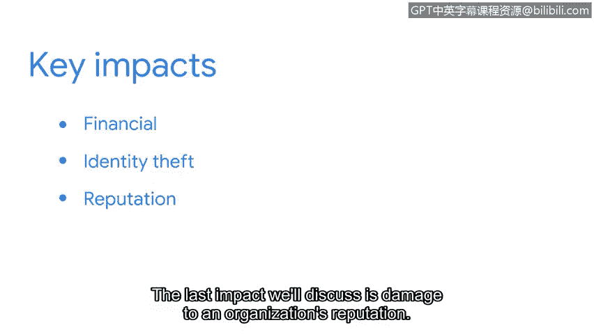

# 042：威胁、风险与漏洞的关键影响

在本视频中，我们将讨论一种名为勒索软件的昂贵恶意软件。然后，我们将探讨威胁、风险和漏洞对组织运营的三个关键影响。

## 勒索软件简介

勒索软件是一种恶意攻击，攻击者会加密组织的数据，然后要求支付赎金以恢复访问权限。一旦攻击者部署了勒索软件，它可以冻结网络系统、使设备无法使用，并加密或锁定机密数据，导致设备无法访问。攻击者随后会要求支付赎金，然后才提供解密密钥，让组织恢复正常业务运营。

您可以将解密密钥视为一个用于重新获取数据访问权限的密码。

请注意，当赎金谈判发生或攻击者泄露数据时，这些事件可能通过暗网进行。

## 网络的三层结构

虽然许多人使用搜索引擎访问社交媒体账户或在线购物，但这只是网络真实面貌的一小部分。网络实际上是一个由三层结构组成的相互链接的在线内容网络：表层网、深层网和暗网。

以下是各层的简要说明：

*   **表层网**：这是大多数人使用的层面。它包含可以通过网页浏览器访问的内容。
*   **深层网**：通常需要授权才能访问。组织的内网就是深层网的一个例子，因为它只能由员工或被授予访问权限的其他人访问。
*   **暗网**：只能通过特殊软件访问。暗网通常带有负面含义，因为其提供的隐秘性使其成为犯罪分子的首选网络层面。

## 威胁、风险与漏洞的三个关键影响

上一节我们介绍了网络的不同层面，本节中我们来看看威胁、风险和漏洞对组织运营的三个关键影响。

### 1. 财务影响

当组织的资产因攻击（例如使用恶意软件）而受损时，其财务后果可能因多种原因而非常严重。

以下是可能产生的财务影响：

*   生产和服务中断。
*   解决问题的成本。
*   如果因不遵守法律法规而导致资产受损，则可能面临罚款。

### 2. 身份盗窃

组织必须决定是否存储客户、员工和外部供应商的私人数据，以及存储多久。存储任何类型的敏感数据都会给组织带来风险。

敏感数据可能包括个人身份信息，这些信息可以通过暗网出售或泄露。这是因为暗网提供了一种隐秘感，攻击者可能能够在那里出售数据而无需承担法律后果。

### 3. 对组织声誉的损害

稳固的客户基础支持着组织的使命、愿景和财务目标。一个被利用的漏洞可能导致客户转而寻求与竞争对手建立新的业务关系，或产生负面新闻，对组织的声誉造成永久性损害。

客户数据的丢失不仅影响组织的声誉和财务状况，还可能导致法律处罚和罚款。

## 总结与展望

本节课中，我们一起学习了勒索软件的工作原理、网络的表层网、深层网和暗网三层结构，以及威胁、风险和漏洞可能带来的财务影响、身份盗窃风险和对组织声誉的损害。组织被强烈建议采取适当的安全措施并遵循特定协议，以预防威胁、风险和漏洞的重大影响。通过利用其工具包中的所有工具，安全团队能更好地应对诸如勒索软件攻击等事件。

接下来，我们将介绍NIST风险管理框架中管理风险的七个步骤。