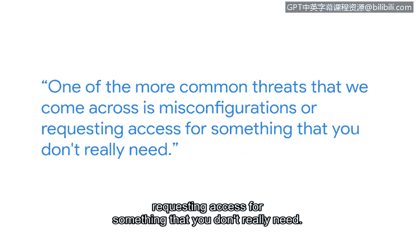

# 043：安全风险管理

## 概述
在本节课中，我们将跟随谷歌安全工程师赫伯特的分享，学习如何管理威胁、风险和漏洞。我们将了解安全工程师的日常工作内容，分析常见的安全问题，并探讨团队协作在网络安全工作中的重要性。

---

## 章节 1：个人背景与兴趣起源 🧑‍💻

我的名字是赫伯特，我是谷歌的一名安全工程师。

我认为我一直对安全领域感兴趣。在高中时，学校给我们配备了这些巨大的戴尔笔记本电脑。那些电脑内部并没有太多的安全措施，所以我很多朋友都拥有像《光环》这类游戏的破解版本。正是在那里，我学会了如何开始操纵电脑，让它按照我的意愿运行。

---

## 章节 2：日常工作与风险分析 🔍

上一节我们介绍了我的兴趣起源，本节中我们来看看我的日常工作内容。

我的日常工作包括分析安全风险，并为这些风险提供解决方案。

网络安全分析师的一项典型任务通常是处理例外请求，分析某人是否因其角色或正在进行的项目而需要特殊访问某个设备或文档。

---

## 章节 3：常见威胁与漏洞 🚨

在了解了日常工作后，我们来看看工作中遇到的一些常见威胁。

我们遇到的一个更常见的威胁是配置错误，或是请求访问他们实际上并不需要的东西。

例如，我最近遇到一个案例，我们合作的一个供应商更改了他们的OAuth范围请求。这基本上意味着，他们请求使用谷歌服务的权限比过去更多。我们之前不确定如何处理这种情况，因为这是我们以前没有遇到过的情况。所以这件事仍在处理中，但我们正在与合作伙伴团队合作，共同制定一个解决方案。

我认为我们看到的另一个问题是过时的系统，即需要打补丁的机器。

---

## 章节 4：跨团队协作的重要性 🤝

上一节我们讨论了具体威胁，本节中我们来看看解决这些问题所需的关键能力。

这听起来像是一个IT问题，但它也绝对是一个网络安全问题。拥有过时的机器，没有适当的设备管理策略。

与一个团队或许多团队合作是这项工作的一个重要部分。为了真正完成任何事情，你不仅需要与你所在的团队沟通，还需要与其他团队沟通。

---

## 章节 5：职业发展与总结 🌟

以下是赫伯特分享的个人职业发展历程。

十年前，我在一家披萨店工作。

十年后，我在这里，作为谷歌的一名安全工程师。

如果我告诉16岁的自己，我会在这里，我可能不会相信。但这是可能的。

---

## 总结
本节课中，我们一起学习了安全风险管理的基本视角。通过赫伯特的经历，我们了解到安全工程师的日常工作涉及**分析风险**和**提供解决方案**，常见威胁包括**配置错误**和**系统过时**，而**跨团队协作**是成功管理这些风险的关键。从披萨店员工到谷歌安全工程师的历程也表明，网络安全领域充满了机遇与可能。