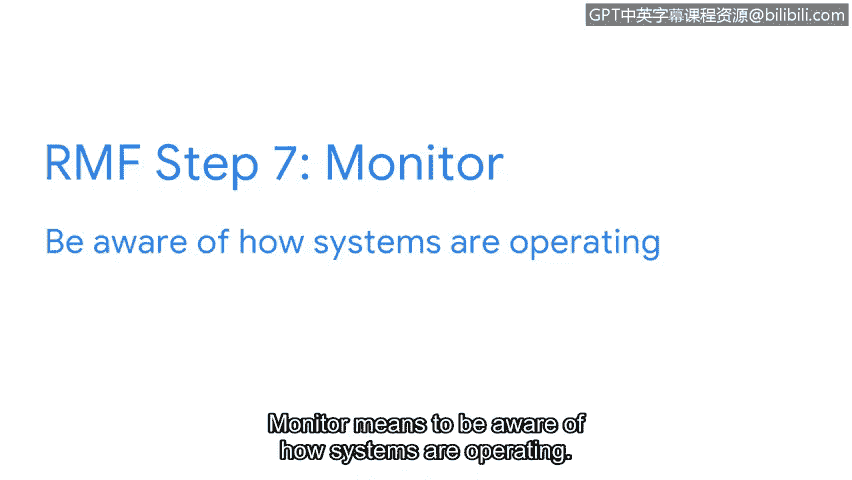

**谷歌网络安全专业证书课程：第二课：《安全风险管理》：P44：NIST风险管理框架（RMF）详解**

在本节中，我们将深入学习美国国家标准与技术研究院（NIST）的风险管理框架。该框架为安全专业人员提供了一套结构化流程，用于系统地管理组织面临的风险、威胁和脆弱性。作为入门级分析师，虽然可能不会参与所有步骤，但理解此框架对于建立扎实的风险管理基础至关重要。

---

**NIST风险管理框架（RMF）概述**

正如您可能在本课程前期所了解到的，NIST提供了众多框架，帮助安全专业人员管理风险、威胁和脆弱性。本节视频将聚焦于NIST的风险管理框架，简称RMF。

掌握如何缓解和管理风险的核心知识，能帮助您在开启安全领域求职时从众多候选人中脱颖而出。

RMF包含七个步骤：准备、分类、选择、实施、评估、授权和监控。

---

**第一步：准备 🛡️**

“准备”指的是在安全事件发生前，为管理安全和隐私风险所必需的活动。

作为入门级分析师，您很可能会在此步骤中监控风险，并识别可用于降低这些风险的控制措施。

---

**第二步：分类 📂**

“分类”用于制定风险管理流程和任务。

安全专业人员随后会运用这些流程，并通过思考系统的**机密性、完整性和可用性**如何受到风险影响来制定具体任务。其核心关系可概括为：**风险 → 可能影响 → (C)机密性 / (I)完整性 / (A)可用性**。

作为分析师，您需要理解如何遵循组织建立的流程，以降低关键资产（如客户私人信息）所面临的风险。

---

**第三步：选择 ✅**

“选择”意味着为保护组织而选择、定制并记录控制措施。

此步骤的一个例子是保持应急预案（playbook）处于最新状态，或帮助管理其他文档，使您和您的团队能更高效地处理问题。

---

**第四步：实施 🚀**

此步骤是为组织实施安全和隐私计划。

制定完善的计划对于最小化持续安全风险的影响至关重要。例如，如果您注意到员工频繁需要重置密码的模式，实施密码要求的变更可能有助于解决此问题。

---

**第五步：评估 🔍**

“评估”旨在确定已建立的控制措施是否正确实施。

组织始终希望尽可能高效地运作，因此花时间分析已实施的协议、程序和控制措施是否满足组织需求至关重要。

在此步骤中，分析师会识别潜在弱点，并判断是否应更改组织的工具、程序、控制和协议，以更好地管理潜在风险。

---

**第六步：授权 📝**

“授权”意味着对组织中可能存在的安全和隐私风险承担责任。

作为分析师，授权步骤可能涉及生成报告、制定行动计划，并建立与组织安全目标一致的项目里程碑。

---

**第七步：监控 📈**

“监控”意味着持续了解系统的运行状况。

评估和维护技术运营是分析师日常完成的任务。为组织维持低风险水平的一部分，在于了解当前系统如何支持组织的安全目标。如果现有系统无法满足这些目标，则可能需要进行变更。

虽然建立这些程序可能不是您的工作职责，但您需要确保它们按预期工作，从而将组织自身及其服务对象所面临的风险降至最低。

---

**总结**

本节课我们一起学习了NIST风险管理框架的七个核心步骤：准备、分类、选择、实施、评估、授权和监控。理解这个结构化流程能帮助您系统地思考和管理安全风险，这是网络安全领域一项重要的基础技能。记住，即使作为入门级分析师，熟悉这些概念也能让您在监控风险、遵循流程和支持团队方面发挥关键作用。