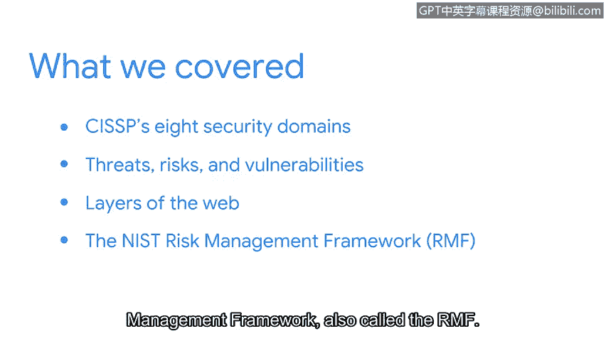

# 045：课程回顾与总结

在本节课程中，我们将回顾并总结已学习的关键安全风险管理概念，并为后续内容做好铺垫。

## 概述

我们已经完成了本课程第一章节的学习。现在，让我们回顾一下到目前为止讨论过的核心内容。

## 章节内容回顾

上一节我们介绍了安全风险管理的基础。本节中，我们来系统地总结已涵盖的知识点。

以下是我们在第一章节中探讨的核心主题：

*   **CISSP的8个安全域**：我们首先探讨了CISSP（注册信息系统安全专家）认证所关注的八个核心安全领域，它们构成了信息安全实践的广泛框架。
*   **威胁、风险与漏洞**：我们讨论了**威胁**、**风险**和**漏洞**的定义及其相互关系。核心关系可以概括为：**风险 ≈ 威胁 × 漏洞**。我们分析了它们如何对组织造成影响。
*   **勒索软件与Web三层架构**：课程包含了对**勒索软件**的深入剖析，并介绍了**Web三层架构**（表现层、逻辑层、数据层）的基本概念。
*   **NIST风险管理框架**：最后，我们重点学习了美国国家标准与技术研究院的**风险管理框架**的七个步骤，该框架常被称为 **RMF**。

## 学习成果与展望

你做得非常出色，为你的安全分析师工具箱增添了新的知识。

在接下来的视频中，我们将更详细地介绍一些入门级安全分析师常用的工具。然后，你将有机会分析这些工具生成的数据，以识别风险、威胁或漏洞。你还将有机会使用**事件响应预案**来模拟应对安全事件。

本节课中，我们一起回顾了安全风险管理的基础，包括核心概念、常见威胁以及NIST RMF框架。这些知识为后续学习具体的安全工具和分析技术奠定了坚实的基础。

请继续保持出色的学习状态。