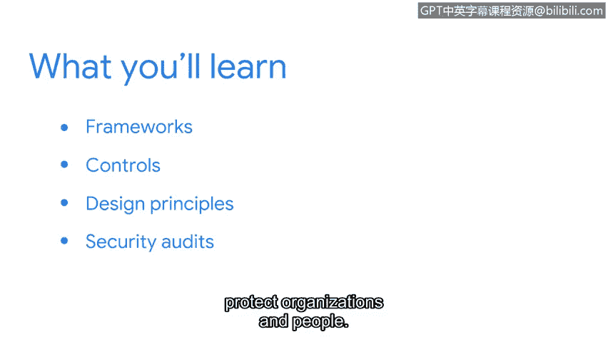

# 046：第2周导论

欢迎回来。作为一名安全分析师，你的工作不仅仅是保护组织安全。你的角色更为重要。你也在帮助保护人们的安全。影响客户、供应商和员工数据的泄露，可能对人们的财务稳定性和声誉造成重大损害。作为一名分析师，你的日常工作将有助于保护人员与组织的安全。

在本课程的这个部分，我们将更详细地讨论安全框架、控制措施和设计原则，以及如何将它们应用于安全审计，以帮助保护组织和人员。

在谷歌，保护客户信息的机密性是我日常工作的关键部分，而NIST网络安全框架在其中扮演了重要角色。该框架通过使用安全控制措施，确保客户工具和个人工作设备的保护与合规性。

欢迎来到安全框架与控制的世界。让我们开始吧。

