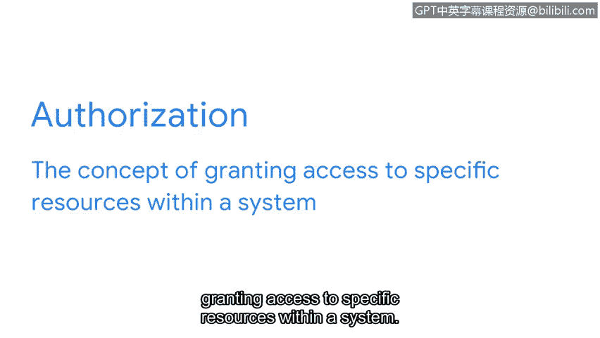

# 048：安全控制措施

在本节课程中，我们将学习安全控制措施。框架用于制定应对安全风险、威胁和弱点的计划，而控制措施则用于降低具体风险。如果未实施适当的控制措施，组织可能因暴露于风险（如非法入侵、创建虚假员工账户或提供免费福利）而面临重大的财务影响和声誉损害。

## 什么是安全控制措施？🔒

上一节我们介绍了风险管理框架，本节中我们来看看具体的安全控制措施。安全控制措施是为降低特定安全风险而设计的防护机制。在本视频中，我们将讨论三种常见的控制类型：加密、身份验证和授权。

## 加密：保护数据机密性 🔐

首先，我们来了解加密。加密是将数据从可读格式转换为编码格式的过程。通常，加密涉及将数据从**明文**转换为**密文**。

*   **密文**是原始的编码信息，对人类和计算机来说都是不可读的。
*   密文数据在被解密回其原始的**明文**形式之前无法被读取。

加密用于确保敏感数据（如客户账户信息或社会安全号码）的机密性。其核心过程可以用以下公式表示：

**加密过程：明文 + 加密密钥 → 密文**
**解密过程：密文 + 解密密钥 → 明文**

## 身份验证：确认身份 ✅

另一种用于保护敏感数据的控制措施是身份验证。身份验证是确认某人或某物身份的过程。

一个现实生活中的身份验证例子是使用用户名和密码登录网站。这种基本形式的身份验证证明你知道用户名和密码，因此应被允许访问该网站。

更高级的身份验证方法，例如**多因素身份验证**，会要求用户同时提供密码和另一种身份验证形式（如安全码或指纹、语音、面部扫描等生物特征），以证明其身份。

*   **生物特征**是可用于验证个人身份的唯一生理特征。
*   生物特征的例子包括指纹、虹膜扫描或掌纹扫描。

一种可能利用生物特征的社会工程攻击是**语音钓鱼**。语音钓鱼是利用电子语音通信来获取敏感信息或冒充已知来源。例如，攻击者可能模仿一个人的声音来窃取其身份并实施犯罪。

## 授权：管理资源访问权限 🚪

另一个非常重要的安全控制措施是授权。授权指的是授予访问系统内特定资源的权限的概念。

本质上，授权用于验证一个人是否有权限访问某个资源。

举个例子，如果你作为一名初级安全分析师为联邦政府工作，你可能被授权访问深网数据或其他仅限联邦雇员访问的内部数据。这体现了授权控制如何根据用户的角色和权限来限制对资源的访问。

## 总结与展望 📚

本节课中我们一起学习了三种核心的安全控制措施：**加密**用于保护数据机密性，**身份验证**用于确认用户身份，**授权**用于管理对系统资源的访问权限。

今天讨论的这些安全控制措施，只是一个核心安全模型——“CIA三要素”——中的一个组成部分。接下来，我们将更详细地探讨这个模型，以及安全团队如何利用它来保护其组织。