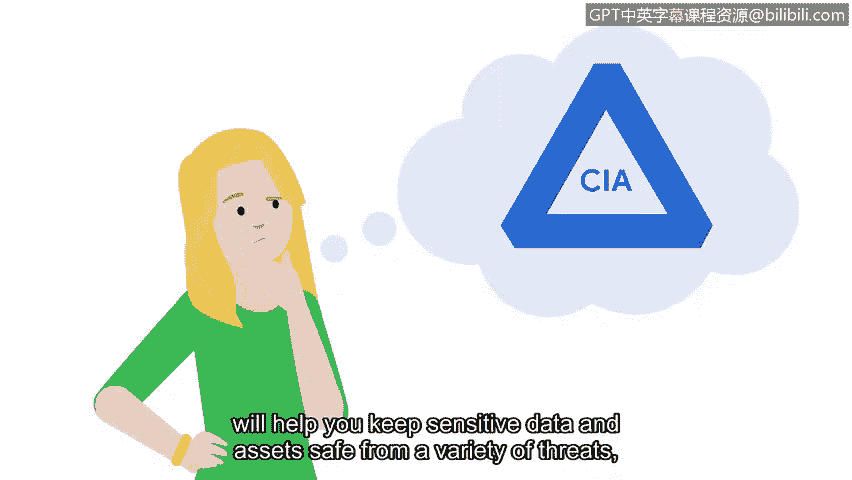

# 049：探索CIA三要素

在本节课中，我们将要学习CIA三要素这一核心安全模型。它定义了信息安全的三个基本目标，是初级安全分析师保护组织敏感资产和数据的重要工具。我们将详细探讨其每个组成部分的含义及其在实践中的重要性。

## 概述CIA三要素

CIA三要素是一个安全模型，它帮助组织在建立系统和安全策略时评估风险。该模型由三个核心原则组成：**保密性**、**完整性**和**可用性**。作为初级分析师，你将在日常工作中频繁运用这些原则来保护组织及其服务对象。

## 详解CIA三要素

上一节我们介绍了CIA三要素的整体概念，本节中我们来看看每个组成部分的具体含义。

### 保密性

保密性意味着只有经过授权的用户才能访问特定的资产或数据。敏感数据应遵循“需要知道”的原则进行管理，确保只有被授权处理特定资产或数据的人员才能访问。

### 完整性

完整性意味着数据是准确、真实且可靠的。作为安全专业人员，判断数据的完整性并分析其使用方式，将帮助你决定这些数据是否可信。

### 可用性

可用性意味着数据对授权访问者是可访问的。无法访问的数据是无用的，并且可能妨碍人们完成工作。确保系统、网络和应用程序正常运行，以提供及时可靠的数据访问，可能是你日常工作职责的一部分。

## 应用CIA三要素

现在我们已经定义了CIA三要素及其组成部分，接下来让我们探索如何运用它来保护组织。

假设你在一家拥有大量私人数据的银行工作，保密性原则至关重要，因为银行必须保护客户的个人和财务信息安全。完整性原则也是优先事项，例如，如果一个人的消费习惯或消费地点发生剧烈变化，银行很可能会禁用账户访问权限，直到他们能确认是账户所有者而非威胁行为者在进行交易。可用性原则同样关键，银行投入大量精力确保人们能通过网络轻松访问账户信息。

为了保护信息免受威胁行为者侵害，银行会使用验证流程，以在怀疑客户账户被盗用时帮助最小化损失。

作为分析师，你将定期运用三要素的每个部分来保护你的组织及其服务对象。时刻牢记CIA三要素，将帮助你保护敏感数据和资产免受各种威胁、风险和漏洞的影响，包括我们之前讨论过的社会工程攻击、恶意软件和数据盗窃。

## 总结

本节课中我们一起学习了CIA三要素——保密性、完整性和可用性。这是一个核心安全模型，能指导你评估风险并制定保护措施。牢记这些原则，是保护组织资产和数据安全的基础。

接下来，我们将探索更多具体的框架和原则，它们也将帮助你保护组织免受威胁、风险和漏洞的侵害。