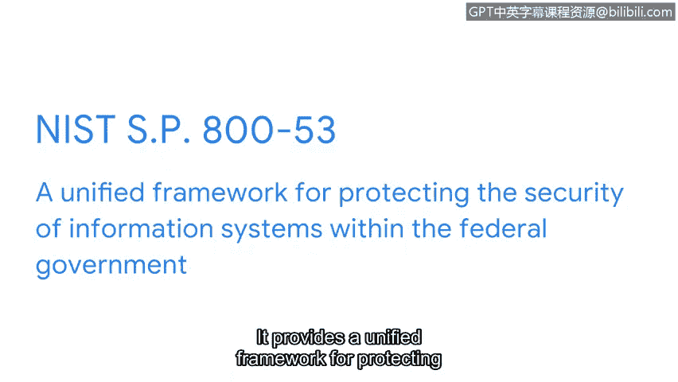

# 050：NIST框架介绍 🛡️

在本节课中，我们将要学习两个由美国国家标准与技术研究院（NIST）制定的重要网络安全框架。这些框架为全球各类组织提供了管理网络安全风险、应对威胁和漏洞的标准化起点与最佳实践指南。

## 框架概述

上一节我们介绍了框架的基本概念。本节中，我们来看看NIST的两个核心框架。

组织使用框架作为制定计划的起点，以降低敏感数据和资产所面临的风险、威胁和漏洞。幸运的是，全球有许多组织创建了可供安全专业人员用来制定这些计划的框架。

NIST是一个美国机构，但其提供的指导可以帮助世界各地的分析师理解如何实施必要的网络安全实践。

## NIST网络安全框架（CSF）

我们将要讨论的第一个NIST框架是NIST网络安全框架（CSF）。CSF是一个自愿性框架，包含用于管理网络安全风险的标准、指南和最佳实践。该框架广受尊重，对于维护任何组织的安全都至关重要。

CSF包含五个重要的核心功能：**识别**、**保护**、**检测**、**响应**和**恢复**。我们将在后续视频中详细讨论这些功能。

现在，我们通过一个工作场所的例子，重点了解CSF如何使组织受益，以及如何用它来防范威胁、风险和漏洞。

想象一下，某天早晨你收到一个高风险通知，称一台工作站已被入侵。你识别出该工作站，并发现有一个未知设备连接在上面。你远程阻止该未知设备以阻止任何潜在威胁，从而保护组织。然后，你隔离受感染的工作站以防止损害扩散，并使用工具检测任何额外的威胁行为者活动，识别该未知设备。你通过调查事件来做出响应，以确定谁使用了该未知设备、威胁是如何发生的、什么受到了影响以及攻击源自何处。😡 在这个案例中，你发现一名员工使用工作笔记本电脑的USB端口为其受感染的手机充电。最后，你尽力恢复任何受影响的文件或数据，并修复威胁对工作站本身造成的任何损害。

如前面的例子所示，NIST CSF的核心功能为安全专业人员提供了具体的指导和方向。该框架用于制定计划，以适当且快速地处理事件，从而降低风险、保护组织免受威胁并缓解任何潜在的漏洞。

## NIST特别出版物 800-53（SP 800-53）

NIST CSF的影响力还扩展到了对美国联邦政府的保护，具体体现在NIST特别出版物800-53（SP 800-53）中。它为保护联邦政府内部信息系统的安全提供了一个统一的框架，包括私营公司为联邦政府使用而提供的系统。该框架提供的安全控制措施用于维护政府所用系统的**CIA三要素**（机密性、完整性、可用性）。

所有这些框架和控制措施协同工作的方式令人惊叹。我们在本视频中讨论了一些非常重要的安全主题，这些主题在你继续安全之旅时将非常有用，因为它们是安全职业的核心要素。

NIST CSF是一个大多数安全专业人员都熟悉的实用框架。如果你有兴趣为美国联邦政府工作，理解NIST SP 800-53至关重要。

## 总结

本节课中我们一起学习了NIST网络安全框架（CSF）及其五个核心功能（识别、保护、检测、响应、恢复）如何通过实际案例指导安全事件处理。我们还了解了NIST特别出版物800-53（SP 800-53）如何为联邦政府信息系统提供统一的安全控制框架。接下来，我们将继续深入探讨NIST CSF的五个功能，以及组织如何利用它们来保护资产和数据。