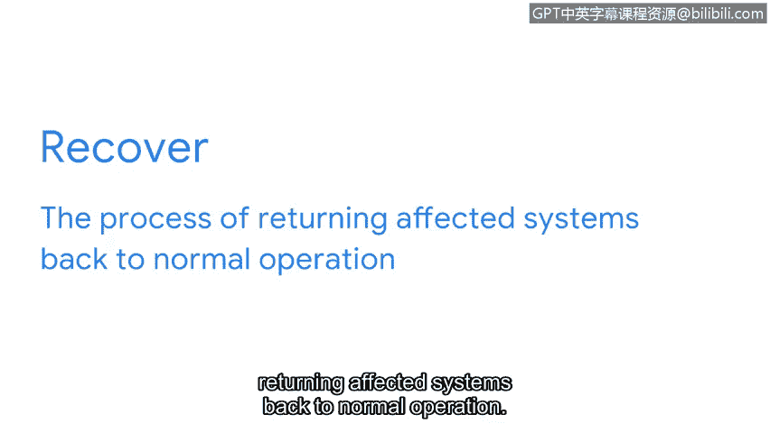

# 051：探索NIST网络安全框架的五大功能

在本节课程中，我们将深入学习NIST网络安全框架的五大核心功能。这些功能构成了组织管理网络安全风险、实施策略并从过往事件中学习的基础。

上一节我们介绍了NIST CSF的用途与优势。本节中，我们将具体聚焦于该框架的五大核心功能。

NIST CSF框架围绕五大核心功能构建：**识别**、**保护**、**检测**、**响应**和**恢复**。这些核心功能帮助组织管理网络安全风险、实施风险管理策略并吸取以往的经验教训。简而言之，在安全运营方面，NIST CSF的功能是确保组织免受潜在威胁、风险和漏洞侵害的关键。

接下来，我们花些时间逐一探讨每个功能如何用于提升组织的安全性。

以下是五大核心功能的详细介绍：

*   **识别**：此功能涉及管理网络安全风险及其对组织人员与资产的影响。例如，作为安全分析师，你可能需要监控组织内部网络的系统和设备，以识别潜在的安全问题，如网络上的受感染设备。
*   **保护**：此功能指通过实施策略、流程、培训和工具来帮助减轻网络安全威胁，从而保护组织。例如，作为安全分析师，你和你的团队可能会遇到新的、不熟悉的威胁和攻击。因此，研究历史数据并改进策略和流程至关重要。
*   **检测**：此功能意味着识别潜在的安全事件，并提升监控能力以加快检测速度与效率。例如，作为分析师，你可能需要审查新设置的安全工具，确保它能正确标记低、中、高风险，并就任何潜在威胁或事件向安全团队发出警报。
*   **响应**：此功能确保使用正确的程序来遏制、消除和分析安全事件，并对安全流程进行改进。例如，作为分析师，你可能需要与团队合作，收集和整理数据以记录事件，并提出流程改进建议以防止事件再次发生。
*   **恢复**：此功能是将受影响的系统恢复正常运行的过程。

例如，作为初级安全分析师，你可能会与安全团队合作，恢复因入侵等事件而受影响的系统、数据及资产（如财务或法律文件）。

本节课中，我们一起学习了关于NIST CSF及其五大核心功能的大量信息。从主动措施到被动措施，所有五个功能对于确保组织拥有有效的安全策略都至关重要。安全事件总会发生，但组织必须具备从事件造成的损害中快速恢复的能力，以将风险水平降至最低。

接下来，我们将讨论与NIST框架和CIA三要素相辅相成的安全原则，这些原则有助于保护关键数据和资产。