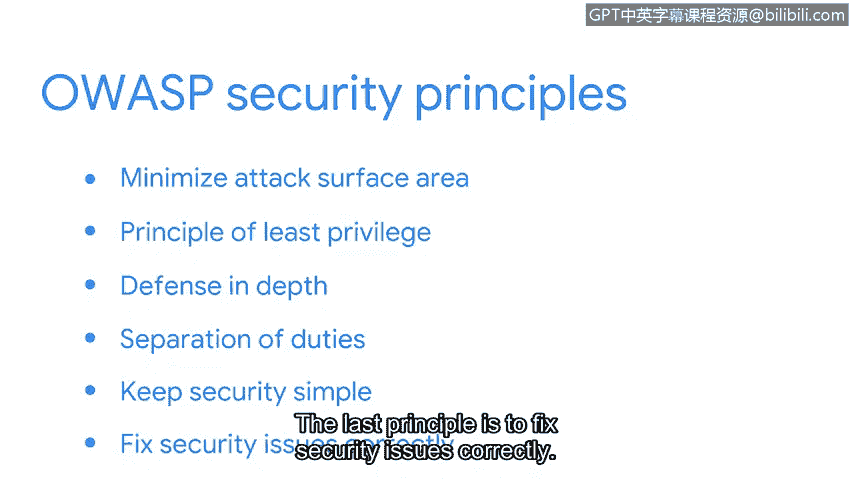

# 052：OWASP安全原则

在本节课程中，我们将学习开放Web应用安全项目（OWASP）提出的几项核心安全原则。这些原则是安全团队在最小化威胁和风险时，可以结合NIST框架和CIA三要素（机密性、完整性、可用性）共同使用的实用指南。

理解如何保护组织的数据和资产至关重要，因为这将是您作为安全分析师职责的一部分。幸运的是，除了NIST框架和CIA三要素，还有一些原则和指南可以帮助安全团队最小化威胁和风险。

接下来，我们将逐一探讨这些对初级分析师非常有用的OWASP安全原则。

## 最小化攻击面

上一节我们提到了安全防护的基础，本节中我们来看看如何缩小被攻击的范围。**攻击面**指的是威胁行为者可能利用的所有潜在漏洞，例如攻击媒介——即攻击者用于渗透安全防御的途径。常见的攻击媒介包括网络钓鱼邮件和弱密码。

为了最小化攻击面并避免由这类媒介引发的事件，安全团队可以采取以下措施：
*   禁用不必要的软件功能。
*   限制对特定资产的访问权限。
*   建立更复杂的密码要求。

## 最小权限原则

在限制了攻击面之后，我们还需要从内部控制访问权限。**最小权限原则**意味着确保用户仅拥有完成其日常工作所必需的最小访问权限。

限制对组织信息和资源访问的主要原因是，为了减少安全漏洞可能造成的损害程度。例如，作为一名初级分析师，您可能有权访问日志数据，但无权更改用户权限。因此，如果威胁行为者盗用了您的凭证，他们也只能获得对数字或物理资产的有限访问权限，这可能不足以让他们部署其预谋的攻击。

## 纵深防御

单一防线容易被突破，因此我们需要建立多层防护。**纵深防御**是指组织应设置多种以不同方式应对风险和威胁的安全控制措施。

一个安全控制的例子是多因素认证（MFA），它要求用户在输入用户名和密码之外，还需完成额外的步骤才能访问应用程序。

其他控制措施包括：
*   防火墙
*   入侵检测系统
*   权限设置

这些控制措施可用于创建威胁行为者必须突破的多重防御点，才能入侵组织。

## 职责分离

除了技术控制，管理上的制衡同样重要。**职责分离**原则可用于防止个人进行欺诈或非法活动。

该原则意味着不应赋予任何人过多的特权，以致其能够滥用系统。例如，公司里签发工资支票的人，不应同时是准备工资支票的人。

## 保持安全措施简单

在实施安全控制时，应避免不必要的复杂解决方案，因为它们可能变得难以管理。安全控制措施越复杂，人们就越难进行协作。

## 正确修复安全问题

技术是强大的工具，但也可能带来挑战。当发生安全事件时，安全专业人员需要快速识别根本原因。此后，重要的是纠正任何已识别的漏洞，并进行测试以确保修复成功。

一个典型的问题是用于访问组织Wi-Fi的弱密码，因为它可能导致安全漏洞。😡

要修复此类安全问题，可以实施更严格的密码策略。

## 总结

本节课中，我们一起学习了六项关键的OWASP安全原则：最小化攻击面、最小权限、纵深防御、职责分离、保持简单以及正确修复。虽然涵盖内容很多，但理解这些原则将提升您的整体安全知识，并帮助您作为一名安全专业人员脱颖而出。