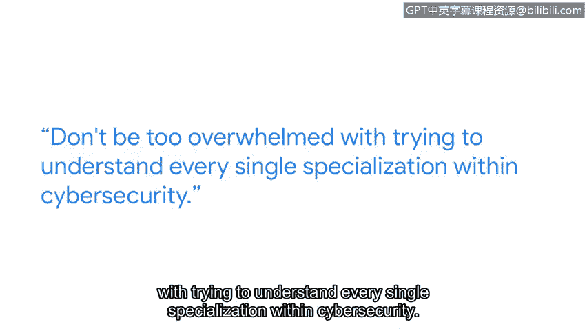

# 053：安全风险管理

## 概述
在本节课中，我们将跟随谷歌安全工程师Waji的分享，学习如何持续跟进最新的网络安全威胁与趋势。课程将介绍实用的信息获取渠道、学习策略以及给初学者的职业建议。

---

## 保持对最新网络安全威胁的了解

我的名字是Waji，我是谷歌数字取证部门的一名安全工程师。

### 进入网络安全领域需要背景吗？
你不需要网络安全背景。我过去的经历包括在水上乐园操作制冰机，在电影院本科期间售卖爆米花和零食。我大一时的专业是生物。我在公交车上遇到一个人，他提到了一家很酷的网络安全初创公司，这听起来非常酷。

### 跟进趋势的策略
以下是我用来跟进最新网络安全趋势的一些策略。

*   **利用在线论坛**：我使用像Medium这样的在线论坛来研究不同的安全趋势和主题。我经常使用Medium，因为你可以通过标签过滤，例如查找与网络安全或云安全相关的文章。基于其过滤算法，我可以浏览并了解其他人正在讨论什么，这帮助我保持信息更新。
*   **参加行业会议**：如果你更期待的是建立人际网络，那么我强烈建议去参加那些行业会议。

### 给初学者的建议
对于想要进入网络安全领域的人，我的建议是不要因为试图理解网络安全内的每一个专业方向而感到不知所措。网络安全领域在趋势方面内容非常丰富，跟进所有这些信息固然很好，但有时你需要退一步，优先确定你最想跟进网络安全中的哪些主题。

我非常热爱这份工作，热爱其中的挑战。根据过去的经验以及从计算机科学领域其他朋友那里听到的，我感觉目前网络安全专业人员存在短缺。他们中的大多数人说进入这个领域太难、太复杂。不要听信这些话。我鼓励你坚持下去，这绝对非常值得。首先掌握基础知识，并保持持之以恒。

---

## 总结
本节课中，我们一起学习了安全工程师Waji关于跟进网络安全动态的实践经验。我们了解到，进入该领域无需特定背景，可以通过**在线论坛（如Medium）** 和**行业会议**等渠道获取信息。关键在于不要贪多，应优先关注自己感兴趣的细分领域，掌握**基础知识**并保持**坚持**。网络安全领域充满挑战与机遇，值得为之努力。