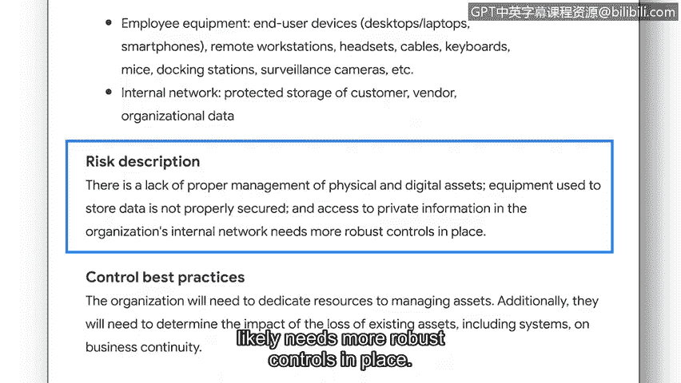

# 054：规划安全审计

## 概述

在本节课中，我们将学习如何规划一次内部安全审计。我们将了解安全审计的定义、目的，并详细探讨审计规划阶段的两个核心要素：**确定范围与目标**以及**进行风险评估**。

---

我们已经介绍了不同的安全框架、控制措施、安全原则和合规法规。随之而来的问题是：它们如何协同工作？

这个问题的答案是：通过执行安全审计。

安全审计是根据一系列预期标准，对组织的安全控制措施、策略和程序进行的审查。安全审计主要有两种类型：外部审计和内部审计。我们将重点关注内部安全审计，因为这是初级分析师可能被要求参与的类型。

内部安全审计通常由一个团队执行，团队成员可能包括组织的合规官、安全经理以及其他安全团队成员。内部安全审计有助于改善组织的安全状况，并帮助组织避免因不合规而遭受监管机构的罚款。内部安全审计能帮助安全团队识别组织风险、评估控制措施并纠正合规问题。

在讨论了内部审计的目的之后，接下来我们看看内部审计的一些常见要素。

以下是内部安全审计通常包含的要素：
*   **确立审计的范围与目标**
*   **对组织资产进行风险评估**
*   **完成控制措施评估**
*   **评估合规性**
*   **向利益相关者传达结果**

在本视频中，我们将介绍前两个要素，它们属于审计规划过程的一部分：确立范围与目标，然后进行风险评估。

**范围**指的是内部安全审计的具体标准。它要求组织识别可能影响其安全状况的人员、资产、政策、程序和技术。

**目标**是组织安全目标的概要，即他们希望通过审计实现什么来改善安全状况。虽然通常由更高级别的安全团队成员和其他利益相关者来确立审计的范围与目标，但初级分析师可能会被要求审查和理解这些范围与目标，以便完成审计的其他部分。

例如，一次审计的范围可能包括：
*   评估用户权限
*   识别现有的控制措施、政策和程序
*   统计组织当前使用的技术

而设定的目标可能包括：
*   实施如NIST CSF等框架的核心功能
*   建立确保合规的政策和程序
*   加强系统控制措施

---

上一节我们介绍了如何确立审计的范围与目标，本节中我们来看看规划阶段的第二个关键要素：**进行风险评估**。

下一个要素是进行**风险评估**，其重点是识别潜在的威胁、风险和漏洞。这有助于组织考虑应该实施和监控哪些安全措施，以确保资产的安全。

与确立范围和目标类似，风险评估通常由经理或其他利益相关者完成。然而，你可能会被要求分析风险评估中提供的细节，以考虑需要建立哪些类型的控制措施和合规法规，来帮助改善组织的安全状况。

例如，一份风险评估报告可能突出显示以下问题：
*   存在保护组织资产的控制措施、流程和程序不足的情况。
*   具体而言，对物理和数字资产（包括员工设备）的管理不当。
*   用于存储数据的设备没有得到妥善保护。
*   对存储在组织内部网络中的私人信息的访问，可能需要更严格的控制措施。

---

## 总结

本节课中，我们一起学习了内部安全审计规划阶段的核心内容。我们明确了安全审计是通过审查控制措施、策略和程序来整合各种安全要素的关键活动。我们重点探讨了规划审计的两个初始步骤：**确立审计范围与目标**，以及**进行风险评估**，理解了它们对于指导后续审计工作、识别风险以及制定改进措施的重要性。在接下来的课程中，我们将继续学习审计的后续要素。