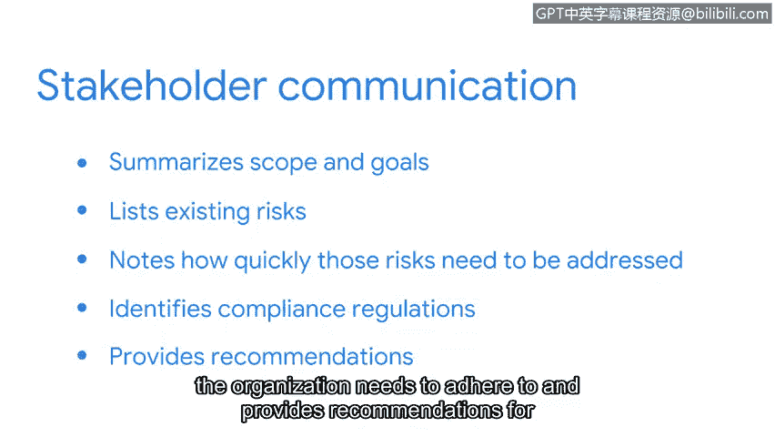

# 055：完成安全审计 🛡️

在本节中，我们将学习如何完成一次内部安全审计。我们将重点介绍审计规划阶段之后的三个核心要素：控制措施评估、合规性评估以及结果沟通。这些步骤对于识别组织安全漏洞和提升整体安全态势至关重要。

上一节我们讨论了内部安全审计的初始规划要素。本节中，我们将介绍初级分析师可能需要完成的后续要素。

作为回顾，内部安全审计的规划要素包括**确立范围与目标**，以及**进行风险评估**。剩余的三个要素是：**完成控制措施评估**、**评估合规性**以及**沟通结果**。

在完成最后这三个要素之前，你需要回顾审计的范围、目标以及风险评估，并向自己提出一些问题。

例如，本次审计旨在实现什么目标？哪些资产面临的风险最高？现有的控制措施是否足以保护这些资产？如果不足，需要实施哪些控制措施和合规性法规？

思考这类问题有助于你完成下一个要素：控制措施评估。

控制措施评估涉及仔细审查组织的现有资产，然后评估这些资产的潜在风险，以确保内部控制和流程是有效的。

以下是初级分析师可能需要完成的任务，将控制措施分为以下几类：

*   **管理控制**：与网络安全中的人员因素相关。它们包括定义组织如何管理数据的政策和程序，例如实施密码策略。
*   **技术控制**：用于保护资产的硬件和软件解决方案，例如使用入侵检测系统或加密技术。
*   **物理控制**：为防止对受保护资产的物理访问而采取的措施，例如监控摄像头和门锁。

下一个要素是确定组织是否遵守了必要的合规性法规。

作为提醒，合规性法规是组织为确保私人数据安全而必须遵守的法律。

在此示例中，该组织在欧盟开展业务并接受信用卡付款，因此他们需要遵守**GDPR**和**支付卡行业数据安全标准**。

内部安全审计的最后一个常见要素是沟通。

一旦内部安全审计完成，需要将结果和建议传达给相关方。

通常，此类沟通会总结审计的范围和目标。然后，它会列出已识别的风险，并注明这些风险需要解决的速度。此外，它还会明确组织需要遵守的合规性法规，并为改善组织的安全态势提供建议。

内部审计是识别组织内部漏洞的好方法。在我之前工作的公司，我和我的团队进行了一次内部密码审计，发现许多密码都很弱。一旦我们发现了这个问题，合规团队就牵头开始执行更严格的密码政策。

审计是一个机会，可以确定组织已具备哪些安全措施，以及哪些领域需要改进以实现组织期望的安全态势。安全审计过程相当复杂，但对组织具有极高的价值。在本课程后续部分，你将有机会为一家虚构公司完成内部安全审计的部分要素，这可以纳入你的专业作品集。

在本节课中，我们一起学习了完成内部安全审计的三个关键步骤：控制措施评估、合规性评估和结果沟通。理解这些步骤能帮助你系统地评估和提升组织的安全防御能力。