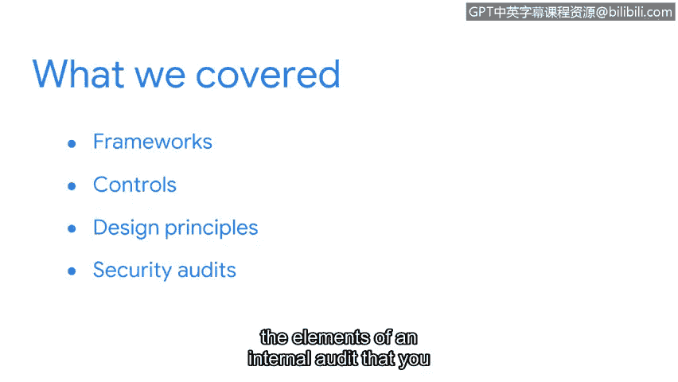

**网络安全基础：第二课：安全风险管理总结**

在本节课中，我们学习了帮助组织保护数据和资产的核心安全概念。这些知识将为你进入安全专业领域奠定坚实的基础。

我们首先定义了**安全框架**及其如何帮助组织保护关键信息。

接着，我们探讨了**安全控制措施**及其在防范风险、威胁和漏洞方面的重要作用。这包括对核心安全模型**CIA三要素**（保密性、完整性、可用性）的讨论，以及两个NIST框架：**网络安全框架**和**SP 800-53**。

然后，我们介绍了一些**OWASP安全设计原则**。

最后，我们引入了**安全审计**，重点介绍了你可能需要完成或参与的内部审计的要素。

---

安全专业人员运用我们讨论的这些概念来保护组织的资产、数据、系统和人员。在你进入安全专业领域的过程中，这些概念会反复出现。我们现在所做的是为你提供安全实践和主题的基础理解，这将对你未来的学习有所帮助。

在课程的下一部分，我们将讨论你未来作为分析师可能使用的具体安全工具。

我们将介绍这些工具如何用于改善组织的安全状况，以及它们如何帮助你实现保护组织和人员安全的目标。很高兴能继续与你一同学习，我们下次见。