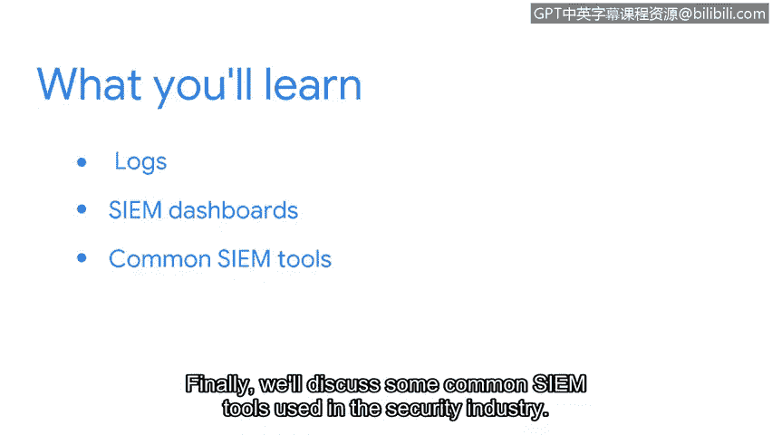

# 057：安全工具入门 🛠️

在本节课中，我们将学习安全专业人员用于收集数据、检测威胁和自动化任务的各种工具。这些工具有助于组织构建更全面的安全态势。

## 日志类型与用途 📝

上一节我们介绍了安全框架、控制措施和设计原则。本节中，我们来看看安全工具，特别是日志。日志是记录系统、网络或应用程序活动的文件，用于追踪事件和识别异常。

以下是几种常见的日志类型及其用途：

*   **系统日志**：记录操作系统事件，如启动、关机、服务状态和错误信息。
*   **网络日志**：记录网络设备（如路由器、防火墙）的活动，包括连接尝试、数据包流量和访问控制事件。
*   **应用程序日志**：记录特定软件应用程序的运行事件，如用户登录、事务处理和错误报告。
*   **安全日志**：专门记录与安全相关的事件，例如登录成功/失败、权限更改和文件访问。

## 安全信息与事件管理仪表板 📊

了解了基础日志后，我们继续探索如何集中管理和分析它们。安全信息与事件管理仪表板是实现这一目标的核心工具。

SIEM（安全信息与事件管理）仪表板是一个集中式界面，用于实时收集、关联和分析来自整个组织的日志和安全警报。它帮助安全团队快速可视化安全状态、识别潜在威胁并做出响应。

## 常见SIEM工具 🧰

最后，我们来了解一些行业中常用的具体SIEM工具。这些工具将我们之前讨论的概念付诸实践。

以下是几种广泛使用的SIEM工具：

*   **Splunk**：一个强大的平台，用于搜索、监控和分析机器生成的大数据，包括日志文件。
*   **Chronicle**：谷歌云旗下的安全分析平台，专注于利用云端基础设施进行威胁检测和调查。
*   **IBM QRadar**：一个集成的SIEM解决方案，提供日志管理、异常检测和事件响应功能。

本节课中我们一起学习了安全工具的基础知识，包括不同类型的日志及其作用、SIEM仪表板的核心功能，以及几种常见的行业工具。掌握这些工具是有效实施安全监控和威胁分析的关键步骤。