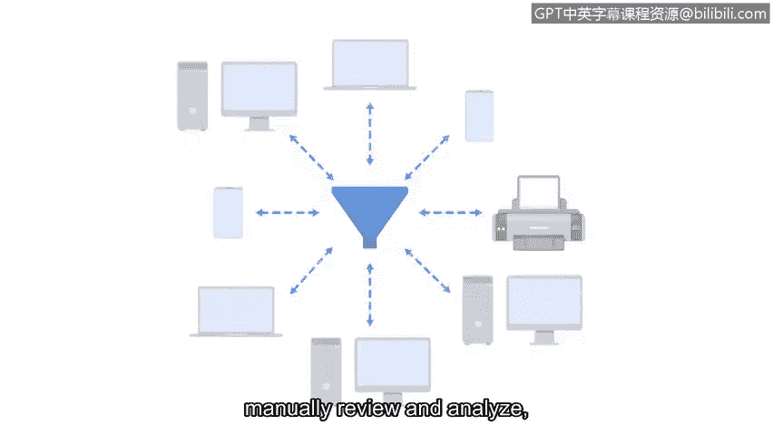

# 058：日志与SIEM工具

在本节课中，我们将要学习日志和SIEM工具。日志是记录系统与网络事件的关键数据源，而SIEM工具则是安全分析师用于收集、分析这些日志以监控威胁的核心平台。理解这两者对于有效进行安全风险管理至关重要。

## 日志：安全事件的基础记录

上一节我们介绍了安全风险管理的基本概念，本节中我们来看看安全分析的基础——日志。作为安全分析师，你的职责之一可能包括分析日志数据，以缓解和管理威胁、风险和漏洞。

需要记住，**日志**是组织系统和网络内发生事件的记录。安全分析师会访问来自不同来源的各种日志。

以下是三种常见的日志来源：

*   **防火墙日志**：记录来自互联网的入站流量尝试或已建立的连接，也包括网络内部向互联网发出的出站请求。
*   **网络日志**：记录所有进入和离开网络的计算机与设备，也记录网络内设备与服务之间的连接。
*   **服务器日志**：记录与网站、电子邮件或文件共享等服务相关的事件，包括登录、密码和用户名请求等操作。

通过监控如上图所示的日志，安全团队能够识别漏洞和潜在的数据泄露。

## SIEM工具：日志的集中分析与监控

理解了日志的重要性后，我们来看看如何高效地利用它们。SIEM工具正是依赖日志来监控系统和检测安全威胁的利器。

**安全信息与事件管理工具**，即**SIEM工具**，是一种收集和分析日志数据以监控组织关键活动的应用程序。它的核心功能可以概括为：

*   **提供实时可见性、事件监控与分析以及自动化警报**。
*   **将所有日志数据存储在集中位置**。

由于SIEM工具能够对日志进行索引，并减少安全专业人员必须手动审查和分析的日志数量，因此它们提高了效率并节省了时间。但需要注意的是，SIEM工具必须经过配置和定制，以满足每个组织独特的安全需求。

随着新的威胁和漏洞不断出现，组织必须持续定制其SIEM工具，以确保威胁能被检测并得到快速处理。

在本证书课程的后续部分，你将有机会练习使用不同的SIEM工具来识别潜在的安全事件。

## 总结与展望

本节课中我们一起学习了日志的三种主要类型（防火墙、网络、服务器日志）以及SIEM工具的核心功能与价值。日志是原始的安全数据，而SIEM工具则是处理这些数据、提供洞察和警报的强大平台。

接下来，我们将探索SIEM仪表板，了解网络安全专业人员如何利用它们来监控威胁、风险和漏洞。