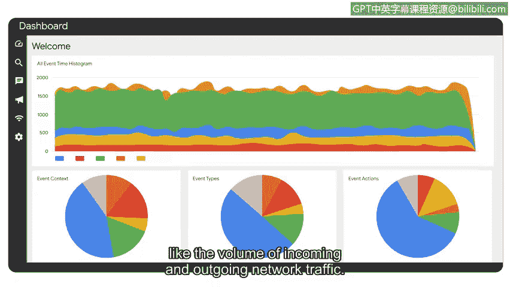

# 059：SIEM仪表盘

## 概述
在本节课中，我们将要学习SIEM工具的另一个重要功能：创建仪表盘。我们将了解仪表盘如何帮助安全分析师快速、直观地访问和分析安全信息，从而做出更明智的决策。

## 仪表盘简介
我们已经探讨了SIEM工具如何用于收集和分析日志数据。然而，这只是SIEM工具在网络安全中的众多用途之一。SIEM工具还可用于创建仪表盘。

你可能在手机或其他设备的应用程序中遇到过仪表盘。它们以易于理解的格式呈现关于你的账户或位置的信息。例如，天气应用程序使用图表、图形和其他视觉元素来显示温度、降水量、风速和预报等数据。这种格式使你能够快速识别天气模式和趋势，从而做好准备并相应地规划你的一天。

## SIEM仪表盘的作用
正如天气应用程序帮助人们根据数据做出快速、明智的决策一样，SIEM仪表盘帮助安全分析师以图表、图形或表格的形式快速、轻松地访问其组织的安全信息。

例如，一位安全分析师收到关于可疑登录尝试的警报。该分析师访问其SIEM仪表盘以收集有关此警报的信息。通过使用仪表盘，分析师发现Yura的账户在五分钟内发生了500次登录尝试。他们还发现，这些登录尝试发生的地理位置超出了Yura通常的位置和她通常的工作时间。

通过使用仪表盘，安全分析师能够快速查看登录尝试时间线、位置和活动确切时间的可视化呈现，从而确定该活动是可疑的。

## 仪表盘中的指标
除了提供安全相关数据的全面摘要外，SIEM仪表盘还向利益相关者提供不同的指标。

指标是关键的技术属性，例如**响应时间、可用性和故障率**，用于评估软件应用程序的性能。

SIEM仪表盘可以进行自定义，以显示与组织中不同成员相关的特定指标或其他数据。

以下是仪表盘可以定制的一些常见指标示例：
*   **网络流量监控**：显示传入和传出网络流量的数据。
*   **系统可用性**：展示关键系统的正常运行时间百分比。
*   **安全事件数量**：按类型或严重性分类显示的事件计数。

## 总结
本节课中我们一起学习了SIEM仪表盘的功能和重要性。我们了解到，仪表盘不仅提供了安全数据的可视化摘要，还能通过自定义指标帮助安全分析师监控日常业务运营，例如网络流量，从而协助组织维持其安全态势。

干得好。

接下来，我们将讨论网络安全行业中一些常见的SIEM工具，我们那里见。