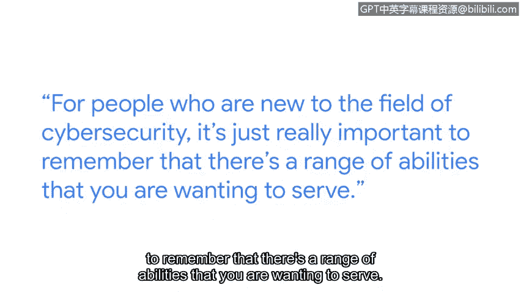

# 060：P60 无障碍与安全的共通之处

在本节课程中，我们将探讨网络安全与无障碍设计之间的重要联系。我们将了解，在设计安全措施时，考虑不同用户的能力差异至关重要，这不仅能提升安全性，还能让技术惠及更广泛的人群。

我的名字是Parissa，我是工程副总裁，并负责领导Chrome团队。作为Chrome团队的总经理，我领导着一个由全球工程师、产品经理和设计师组成的团队，共同构建Chrome浏览器并确保所有用户的安全。

我认为无障碍设计对技术的各个方面都很重要。当我们思考它与网络安全的相关性时，我们最终的目标是保护每个人的安全。我将无障碍设计理解为，使信息、活动甚至环境对尽可能多的人而言有意义、可感知、可使用。从技术角度来看，这通常意味着让残障人士也能获取信息或服务。

我们基于自身能力做出的安全增强决策，实际上可能效果不佳。例如，有时会用红色来表示警告，但对于色盲人士来说，这将是无效的。因此，在我们试图保护人们安全时，充分考虑无障碍性，对于安全措施的有效性至关重要。

## 安全与无障碍的共通之处 🧩

上一节我们提到了考虑无障碍性的重要性，本节中我们来看看安全与无障碍设计领域之间的具体相似之处。

我在安全领域工作了很长时间，确实看到了这两个领域之间的一些共通点。当你试图解决一个非常具体的安全问题或无障碍问题时，我真正看到了创新的驱动力。隐藏式字幕最初是为了帮助听力障碍人士而设计和构建的，但最终它帮助了所有人。

对于刚进入网络安全领域的人来说，记住你想要服务的用户能力范围是至关重要的。获取用户研究和反馈，并在测试安全缓解措施有效性时涵盖不同能力范围，这一点非常重要。

## 给初学者的建议与鼓励 💪

了解了核心概念后，以下是给网络安全领域新人的一些建议。

我知道在早期这很可怕，我和其他人看起来不一样，我真的很挣扎于我是否属于这里。找到可以成为导师的人，鼓起勇气提问，并认识到你很少是唯一有那个问题的人，有时只是坚持度过艰难时刻就能带来突破，也能逐渐建立信心。

我学到的一点是，我拥有与这个领域其他人不同的背景，这恰恰是我的超能力。我不应专注于我与房间里常态之间的差距，而应该为我自身的独特性以及我为团队带来的独特技能和视角感到自豪。

## 总结 📝

本节课中我们一起学习了网络安全与无障碍设计的紧密联系。核心在于，有效的安全措施必须考虑所有用户的能力差异，**安全设计 = 普适性设计**。同时，作为从业者，独特的背景和视角是宝贵的财富。记住，创新往往源于解决特定人群的具体问题，并最终惠及所有人。