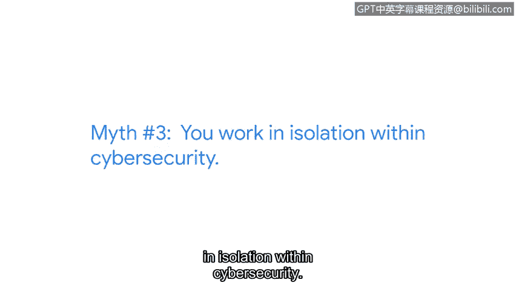

**谷歌网络安全专业证书：第二课：网络安全领域的常见误区**

在本节课中，我们将探讨网络安全领域普遍存在的几个误区，并了解如何根据个人兴趣和技能规划自己的职业道路。

---

我是塔莉亚，是谷歌隐私、安全与保障部门的一名工程师。

网络安全领域存在很多误区。

**误区一：必须精通编程、黑客技术或数学**

一个很大的误区是，你必须会编程、必须懂黑客技术，或者必须是数学天才。我不会编程，尽管随着时间推移我学会了阅读代码。我也不是黑客，我并非从事安全领域的“红队”（攻击方）工作，而更像是“蓝队”（防御方）。我更不是数学天才，我走的是商业路线，而非数学家的道路。

**误区二：必须拥有网络安全学位**

另一个重大误区是，你必须拥有网络安全学位。我实际上在大学攻读的是商科。学位并非必需，尽管我后来重返校园，但那是我个人的选择。你不需要为了被视为网络安全领域的优秀候选人而必须攻读相关学位。

**误区三：网络安全工作意味着孤立无援**

还有一个误区是，网络安全工作意味着孤立无援。这实际上取决于你选择的职业路径。但我发现，这远非事实。我的工作需要大量协作。

---

上一节我们澄清了几个常见误区，本节中我们来看看如何规划个人职业发展路径。

**规划你的网络安全职业道路**

以下是我对任何对网络安全感兴趣的人的最大建议：

*   **乐于开创自己的道路**：每个人的道路看起来都不同。如果你和五个不同的人交谈，他们的旅程都会有所不同。
*   **识别并寻求支持者**：在你的旅程中，识别那些能够支持你的人，让他们知道你正在攻读这个证书，看看在你启程时能获得什么样的支持。

---

本节课中我们一起学习了网络安全领域的几个常见误区，包括对编程、学位和工作性质的误解。重要的是认识到，网络安全职业道路是多样化的，关键在于发挥个人优势，如建立关系、快速学习和善于提问，并勇于开创属于自己的独特路径。